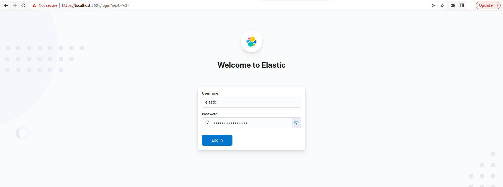
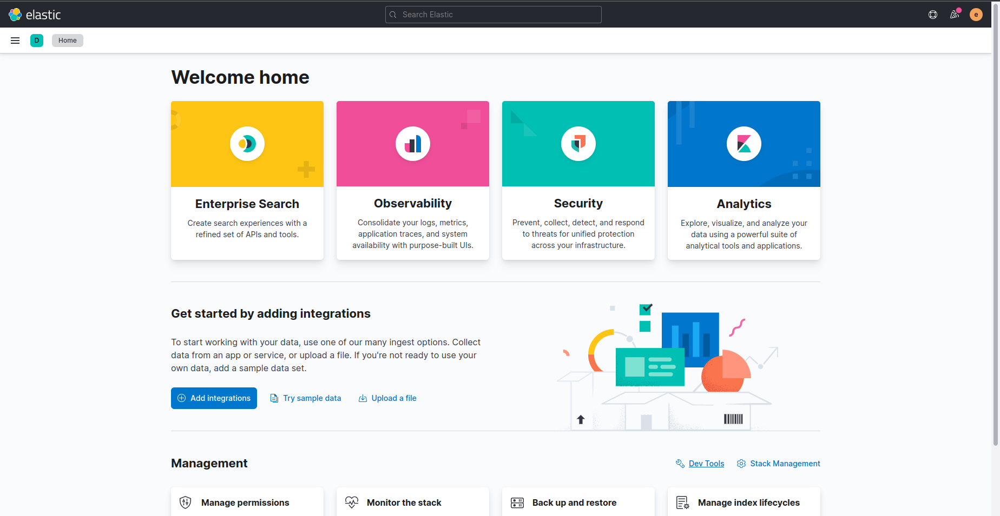
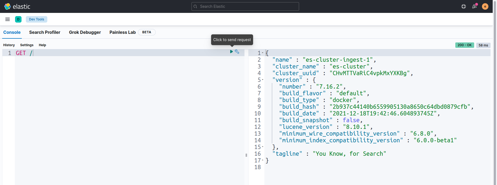
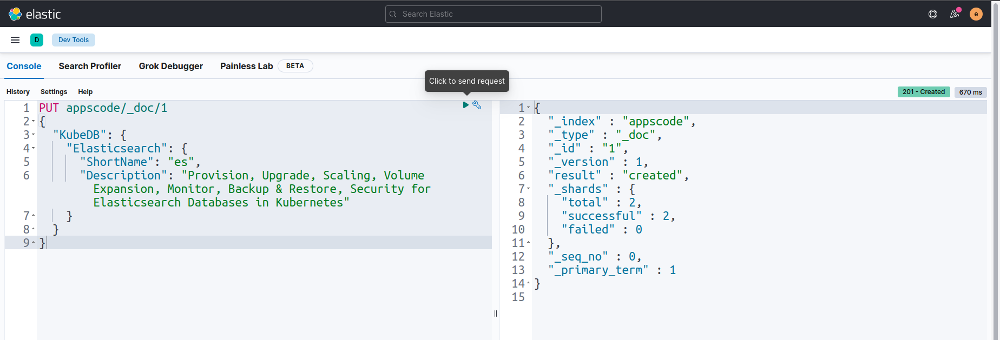
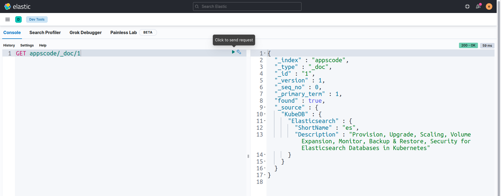
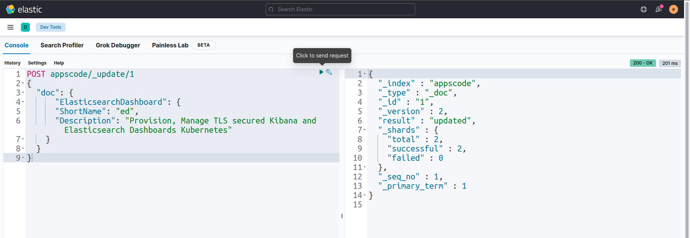
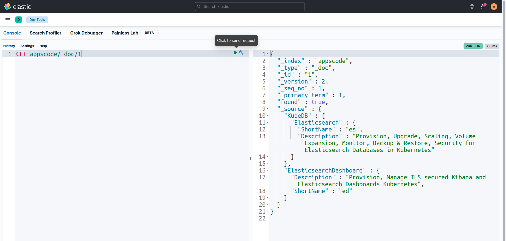
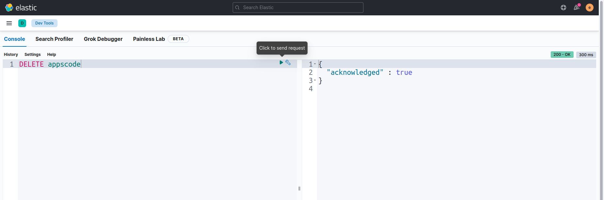

> New to KubeDB? Please start [here](/docs/README.md).

# Deploy Kibana With ElasticsearchDashboard

## Before You Begin

At first, you need to have a Kubernetes cluster, and the `kubectl` command-line tool must be configured to communicate with your cluster. If you do not already have a cluster, you can create one by using [kind](https://kind.sigs.k8s.io/docs/user/quick-start/).

Now, install the KubeDB operator in your cluster following the steps [here](/docs/setup/README.md).

To keep things isolated, this tutorial uses a separate namespace called `demo` throughout this tutorial.

```bash
$ kubectl create namespace demo
namespace/demo created

$ kubectl get namespace
NAME                 STATUS   AGE
demo                 Active   11s
```

> Note: YAML files used in this tutorial are stored in [here](https://github.com/kubedb/docs/tree//docs/guides/elasticsearch/elasticsearch-dashboard/kibana/yamls) in GitHub repository [kubedb/docs](https://github.com/kubedb/docs).

## Find Available StorageClass

We will have to provide `StorageClass` in Elasticsearch CR specification. Check available `StorageClass` in your cluster using the following command,

```bash
$ kubectl get storageclass
NAME                 PROVISIONER             RECLAIMPOLICY   VOLUMEBINDINGMODE      ALLOWVOLUMEEXPANSION   AGE
standard (default)   rancher.io/local-path   Delete          WaitForFirstConsumer   false                  1h
```

Here, we have `standard` StorageClass in our cluster from [Local Path Provisioner](https://github.com/rancher/local-path-provisioner).

## Create an Elasticsearch Cluster

We are going to create a Elasticsearch Simple Dedicated Cluster in topology mode. Our cluster will be consist of 2 master nodes, 3 data nodes, 2 ingest nodes. Here, we are using Elasticsearch version (`xpack-8.2.3`) of Elasticsearch distribution for this demo. To learn more about the Elasticsearch CR, visit [here](/docs/guides/elasticsearch/concepts/elasticsearch/index.md).

```yaml
apiVersion: kubedb.com/v1
kind: Elasticsearch
metadata:
  name: es-cluster
  namespace: demo
spec:
  enableSSL: true 
  version: xpack-8.2.3
  storageType: Durable
  topology:
    master:
      replicas: 2
      storage:
        storageClassName: "standard"
        accessModes:
        - ReadWriteOnce
        resources:
          requests:
            storage: 1Gi
    data:
      replicas: 3
      storage:
        storageClassName: "standard"
        accessModes:
        - ReadWriteOnce
        resources:
          requests:
            storage: 1Gi
    ingest:
      replicas: 2
      storage:
        storageClassName: "standard"
        accessModes:
        - ReadWriteOnce
        resources:
          requests:
            storage: 1Gi
```

Here,

- `spec.version` - is the name of the ElasticsearchVersion CR. Here, we are using Elasticsearch version `xpack-8.2.3` of Elasticsearch distribution.
- `spec.enableSSL` - specifies whether the HTTP layer is secured with certificates or not.
- `spec.storageType` - specifies the type of storage that will be used for Elasticsearch database. It can be `Durable` or `Ephemeral`. The default value of this field is `Durable`. If `Ephemeral` is used then KubeDB will create the Elasticsearch database using `EmptyDir` volume. In this case, you don't have to specify `spec.storage` field. This is useful for testing purposes.
- `spec.topology` - specifies the node-specific properties for the Elasticsearch cluster.
  - `topology.master` - specifies the properties of master nodes.
    - `master.replicas` - specifies the number of master nodes.
    - `master.storage` - specifies the master node storage information that passed to the PetSet.
  - `topology.data` - specifies the properties of data nodes.
    - `data.replicas` - specifies the number of data nodes.
    - `data.storage` - specifies the data node storage information that passed to the PetSet.
  - `topology.ingest` - specifies the properties of ingest nodes.
    - `ingest.replicas` - specifies the number of ingest nodes.
    - `ingest.storage` - specifies the ingest node storage information that passed to the PetSet.

Let's deploy the above yaml by the following command:

```bash
$ kubectl apply -f https://github.com/kubedb/docs/raw//docs/guides/elasticsearch//elasticsearch-dashboard/kibana/yamls/es-cluster.yaml
elasticsearch.kubedb.com/es-cluster created
```
KubeDB will create the necessary resources to deploy the Elasticsearch cluster according to the above specification. Let’s wait until the database to be ready to use,

```bash
$ watch kubectl get elasticsearch -n demo
NAME         VERSION              STATUS   AGE
es-cluster   xpack-8.2.3          Ready    4m32s
```
Here, Elasticsearch is in `Ready` state. It means the database is ready to accept connections.

Describe the Elasticsearch object to observe the progress if something goes wrong or the status is not changing for a long period of time:

```bash
$ kubectl describe elasticsearch -n demo es-cluster
Name:         es-cluster
Namespace:    demo
Labels:       <none>
Annotations:  <none>
API Version:  kubedb.com/v1
Kind:         Elasticsearch
Metadata:
  Creation Timestamp:  2022-06-08T11:03:43Z
  Finalizers:
    kubedb.com
  Generation:  1
  Resource Version:  1047187
  UID:               dd90071c-8e64-420f-a836-2be9459e728a
Spec:
  Auth Secret:
    Name:                es-cluster-elastic-cred
  Enable SSL:            true
  Heap Size Percentage:  50
  Internal Users:
    apm_system:
      Backend Roles:
        apm_system
      Secret Name:  es-cluster-apm-system-cred
    beats_system:
      Backend Roles:
        beats_system
      Secret Name:  es-cluster-beats-system-cred
    Elastic:
      Backend Roles:
        superuser
      Secret Name:  es-cluster-elastic-cred
    kibana_system:
      Backend Roles:
        kibana_system
      Secret Name:  es-cluster-kibana-system-cred
    logstash_system:
      Backend Roles:
        logstash_system
      Secret Name:  es-cluster-logstash-system-cred
    remote_monitoring_user:
      Backend Roles:
        remote_monitoring_collector
        remote_monitoring_agent
      Secret Name:  es-cluster-remote-monitoring-user-cred
  Kernel Settings:
    Privileged:  true
    Sysctls:
      Name:   vm.max_map_count
      Value:  262144
  Pod Template:
    Controller:
    Metadata:
    Spec:
      Affinity:
        Pod Anti Affinity:
          Preferred During Scheduling Ignored During Execution:
            Pod Affinity Term:
              Label Selector:
                Match Expressions:
                  Key:       ${NODE_ROLE}
                  Operator:  Exists
                Match Labels:
                  app.kubernetes.io/instance:    es-cluster
                  app.kubernetes.io/managed-by:  kubedb.com
                  app.kubernetes.io/name:        elasticsearches.kubedb.com
              Namespaces:
                demo
              Topology Key:  kubernetes.io/hostname
            Weight:          100
            Pod Affinity Term:
              Label Selector:
                Match Expressions:
                  Key:       ${NODE_ROLE}
                  Operator:  Exists
                Match Labels:
                  app.kubernetes.io/instance:    es-cluster
                  app.kubernetes.io/managed-by:  kubedb.com
                  app.kubernetes.io/name:        elasticsearches.kubedb.com
              Namespaces:
                demo
              Topology Key:  failure-domain.beta.kubernetes.io/zone
            Weight:          50
      Container Security Context:
        Capabilities:
          Add:
            IPC_LOCK
            SYS_RESOURCE
        Privileged:   false
        Run As User:  1000
      Resources:
      Service Account Name:  es-cluster
  Storage Type:              Durable
  Termination Policy:        Delete
  Tls:
    Certificates:
      Alias:  ca
      Private Key:
        Encoding:   PKCS8
      Secret Name:  es-cluster-ca-cert
      Subject:
        Organizations:
          kubedb
      Alias:  transport
      Private Key:
        Encoding:   PKCS8
      Secret Name:  es-cluster-transport-cert
      Subject:
        Organizations:
          kubedb
      Alias:  http
      Private Key:
        Encoding:   PKCS8
      Secret Name:  es-cluster-http-cert
      Subject:
        Organizations:
          kubedb
      Alias:  client
      Private Key:
        Encoding:   PKCS8
      Secret Name:  es-cluster-client-cert
      Subject:
        Organizations:
          kubedb
  Topology:
    Data:
      Replicas:  3
      Resources:
        Limits:
          Memory:  2Gi
        Requests:
          Cpu:     100m
          Memory:  1.5Gi
      Storage:
        Access Modes:
          ReadWriteOnce
        Resources:
          Requests:
            Storage:         1Gi
        Storage Class Name:  standard
      Suffix:                data
    Ingest:
      Replicas:  2
      Resources:
        Limits:
          Memory:  2Gi
        Requests:
          Cpu:     100m
          Memory:  1.5Gi
      Storage:
        Access Modes:
          ReadWriteOnce
        Resources:
          Requests:
            Storage:         1Gi
        Storage Class Name:  standard
      Suffix:                ingest
    Master:
      Replicas:  2
      Resources:
        Limits:
          Memory:  2Gi
        Requests:
          Cpu:     100m
          Memory:  1.5Gi
      Storage:
        Access Modes:
          ReadWriteOnce
        Resources:
          Requests:
            Storage:         1Gi
        Storage Class Name:  standard
      Suffix:                master
  Version:                   xpack-8.2.3
Status:
  Conditions:
    Last Transition Time:  2022-06-08T11:03:43Z
    Message:               The KubeDB operator has started the provisioning of Elasticsearch: demo/es-cluster
    Reason:                DatabaseProvisioningStartedSuccessfully
    Status:                True
    Type:                  ProvisioningStarted
    Last Transition Time:  2022-06-08T11:09:31Z
    Message:               Internal Users for Elasticsearch: demo/es-cluster is ready.
    Observed Generation:   1
    Reason:                InternalUsersCredentialsSyncedSuccessfully
    Status:                True
    Type:                  InternalUsersSynced
    Last Transition Time:  2022-06-08T11:04:24Z
    Message:               All desired replicas are ready.
    Reason:                AllReplicasReady
    Status:                True
    Type:                  ReplicaReady
    Last Transition Time:  2022-06-08T11:08:58Z
    Message:               The Elasticsearch: demo/es-cluster is accepting client requests.
    Observed Generation:   1
    Reason:                DatabaseAcceptingConnectionRequest
    Status:                True
    Type:                  AcceptingConnection
    Last Transition Time:  2022-06-08T11:09:31Z
    Message:               The Elasticsearch: demo/es-cluster is ready.
    Observed Generation:   1
    Reason:                ReadinessCheckSucceeded
    Status:                True
    Type:                  Ready
    Last Transition Time:  2022-06-08T11:09:44Z
    Message:               The Elasticsearch: demo/es-cluster is successfully provisioned.
    Observed Generation:   1
    Reason:                DatabaseSuccessfullyProvisioned
    Status:                True
    Type:                  Provisioned
  Observed Generation:     1
  Phase:                   Ready
Events:
  Type    Reason      Age    From             Message
  ----    ------      ----   ----             -------
  Normal  Successful  6m27s  KubeDB Operator  Successfully created governing service
  Normal  Successful  6m27s  KubeDB Operator  Successfully created Service
  Normal  Successful  6m27s  KubeDB Operator  Successfully created Service
  Normal  Successful  6m25s  KubeDB Operator  Successfully created Elasticsearch
  Normal  Successful  6m25s  KubeDB Operator  Successfully created appbinding
  Normal  Successful  6m25s  KubeDB Operator  Successfully  governing service
  Normal  Successful  6m22s  KubeDB Operator  Successfully  governing service

```
- Here, in `Status.Conditions` 
  - `Conditions.Status` is `True` for the `Condition.Type:ProvisioningStarted` which means database provisioning has been started successfully.
  - `Conditions.Status` is `True` for the `Condition.Type:ReplicaReady` which specifies all replicas are ready in the cluster.
  - `Conditions.Status` is `True` for the `Condition.Type:AcceptingConnection` which means database has been accepting connection request.
  - `Conditions.Status` is `True` for the `Condition.Type:Ready` which defines database is ready to use.
  - `Conditions.Status` is `True` for the `Condition.Type:Provisioned` which specifies Database has been successfully provisioned.

### KubeDB Operator Generated Resources

Let's check the Kubernetes resources created by the operator on the deployment of Elasticsearch CRO:

```bash
$ kubectl get all,secret,pvc -n demo -l 'app.kubernetes.io/instance=es-cluster'
NAME                      READY   STATUS    RESTARTS   AGE
pod/es-cluster-data-0     1/1     Running   0          13m
pod/es-cluster-data-1     1/1     Running   0          13m
pod/es-cluster-data-2     1/1     Running   0          13m
pod/es-cluster-ingest-0   1/1     Running   0          13m
pod/es-cluster-ingest-1   1/1     Running   0          13m
pod/es-cluster-master-0   1/1     Running   0          13m
pod/es-cluster-master-1   1/1     Running   0          13m

NAME                        TYPE        CLUSTER-IP     EXTERNAL-IP   PORT(S)    AGE
service/es-cluster          ClusterIP   10.96.135.31   <none>        9200/TCP   13m
service/es-cluster-master   ClusterIP   None           <none>        9300/TCP   13m
service/es-cluster-pods     ClusterIP   None           <none>        9200/TCP   13m

NAME                                 READY   AGE
petset.apps/es-cluster-data     3/3     13m
petset.apps/es-cluster-ingest   2/2     13m
petset.apps/es-cluster-master   2/2     13m

NAME                                            TYPE                       VERSION   AGE
appbinding.appcatalog.appscode.com/es-cluster   kubedb.com/elasticsearch   8.2.0     13m

NAME                                            TYPE                       DATA   AGE
secret/es-cluster-apm-system-cred               kubernetes.io/basic-auth   2      13m
secret/es-cluster-beats-system-cred             kubernetes.io/basic-auth   2      13m
secret/es-cluster-ca-cert                       kubernetes.io/tls          2      13m
secret/es-cluster-client-cert                   kubernetes.io/tls          3      13m
secret/es-cluster-config                        Opaque                     1      13m
secret/es-cluster-elastic-cred                  kubernetes.io/basic-auth   2      13m
secret/es-cluster-http-cert                     kubernetes.io/tls          3      13m
secret/es-cluster-kibana-system-cred            kubernetes.io/basic-auth   2      13m
secret/es-cluster-logstash-system-cred          kubernetes.io/basic-auth   2      13m
secret/es-cluster-remote-monitoring-user-cred   kubernetes.io/basic-auth   2      13m
secret/es-cluster-transport-cert                kubernetes.io/tls          3      13m

NAME                                             STATUS   VOLUME                                     CAPACITY   ACCESS MODES   STORAGECLASS   AGE
persistentvolumeclaim/data-es-cluster-data-0     Bound    pvc-ef297d44-6adc-4307-ac53-93d09999622a   1Gi        RWO            standard       13m
persistentvolumeclaim/data-es-cluster-data-1     Bound    pvc-9bc2ccc5-f775-49f5-9148-f1b70a1cd3b3   1Gi        RWO            standard       13m
persistentvolumeclaim/data-es-cluster-data-2     Bound    pvc-fca1f3fc-a9e6-4fd2-8531-767c4f4286ee   1Gi        RWO            standard       13m
persistentvolumeclaim/data-es-cluster-ingest-0   Bound    pvc-77f128cf-d0b5-40e2-94fd-1be506a17a4a   1Gi        RWO            standard       13m
persistentvolumeclaim/data-es-cluster-ingest-1   Bound    pvc-024a1697-7737-4a53-8f48-e89ee0530cad   1Gi        RWO            standard       13m
persistentvolumeclaim/data-es-cluster-master-0   Bound    pvc-775f89a2-4fcd-4660-b0c3-8c46dd1b0a67   1Gi        RWO            standard       13m
persistentvolumeclaim/data-es-cluster-master-1   Bound    pvc-53fd7683-96a6-4737-9c4c-eade942e6743   1Gi        RWO            standard       13m

```

- `PetSet` - 3 PetSets are created for 3 types Elasticsearch nodes. The PetSets are named after the Elasticsearch instance with given suffix: `{Elasticsearch-Name}-{Sufix}`.
- `Services` -  3 services are generated for each Elasticsearch database.
  - `{Elasticsearch-Name}` - the client service which is used to connect to the database. It points to the `ingest` nodes.
  - `{Elasticsearch-Name}-master` - the master service which is used to connect to the master nodes. It is a headless service.
  - `{Elasticsearch-Name}-pods` - the node discovery service which is used by the Elasticsearch nodes to communicate each other. It is a headless service.
- `AppBinding` - an [AppBinding](/docs/guides/elasticsearch/concepts/appbinding/index.md) which hold the connect information for the database. It is also named after the Elastics
- `Secrets` - 3 types of secrets are generated for each Elasticsearch database.
  - `{Elasticsearch-Name}-{username}-cred` - the auth secrets which hold the `username` and `password` for the Elasticsearch users.
  - `{Elasticsearch-Name}-{alias}-cert` - the certificate secrets which hold `tls.crt`, `tls.key`, and `ca.crt` for configuring the Elasticsearch database.
  - `{Elasticsearch-Name}-config` - the default configuration secret created by the operator.

## Deploy ElasticsearchDashboard

```yaml
apiVersion: elasticsearch.kubedb.com/v1alpha1
kind: ElasticsearchDashboard
metadata:
  name: es-cluster-dashboard
  namespace: demo
spec:
  enableSSL: true
  databaseRef:
    name: es-cluster
  terminationPolicy: WipeOut
```
> Note: Elasticsearch Database and Elasticsearch dashboard should have to be deployed in the same namespace. In this tutorial, we use demo namespace for both cases.

- `spec.enableSSL` specifies whether the HTTP layer is secured with certificates or not.
- `spec.databaseRef.name` refers to the Elasticsearch database name.
- `spec.deletionPolicy` refers to the strategy to follow during dashboard deletion. `Wipeout` means that the database will be deleted without restrictions. It can also be `DoNotTerminate` which will cause a restriction to delete the dashboard. Learn More about these [HERE](https://kubedb.com/docs/v2022.05.24/guides/elasticsearch/concepts/elasticsearch/#specdeletionpolicy).

Let's deploy the above yaml by the following command:

```bash
$ kubectl apply -f https://github.com/kubedb/docs/raw//docs/guides/elasticsearch/elasticsearch-dashboard/kibana/yamls/es-cluster-dashboard.yaml
elasticsearchdashboard.elasticsearch.kubedb.com/es-cluster-dashboard created
```

KubeDB will create the necessary resources to deploy the dashboard
 according to the above specification. Let’s wait until the database to be ready to use,

```bash
$ watch kubectl get elasticsearchdashboard -n demo
NAME                   TYPE                            DATABASE     STATUS   AGE
es-cluster-dashboard   elasticsearch.kubedb.com/v1alpha1   es-cluster   Ready    9m
```
Here, Elasticsearch Dashboard is in `Ready` state. 


## Connect with Elasticsearch Dashboard

We will use [port forwarding](https://kubernetes.io/docs/tasks/access-application-cluster/port-forward-access-application-cluster/) to connect with our Elasticsearch dashboard. Then We are going to login into kibana with authentication credentials and make API requests from dev tools to check cluster health so that we can verify that our Elasticsearch database is working well.

#### Port-forward the Service

KubeDB will create few Services to connect with the database. Let’s check the Services by following command,

```bash
$ kubectl get service -n demo
NAME                   TYPE        CLUSTER-IP      EXTERNAL-IP   PORT(S)    AGE
es-cluster             ClusterIP   10.96.103.250   <none>        9200/TCP   13m
es-cluster-dashboard   ClusterIP   10.96.108.252   <none>        5601/TCP   11m
es-cluster-master      ClusterIP   None            <none>        9300/TCP   13m
es-cluster-pods        ClusterIP   None            <none>        9200/TCP   13m

```
Here, we are going to use `es-cluster-dashboard` Service to connect with the database. Now, let’s port-forward the `es-cluster` Service to the port `5601` to local machine:

```bash
$ kubectl port-forward -n demo service/es-cluster-dashboard 5601
Forwarding from 127.0.0.1:5601 -> 5601
Forwarding from [::1]:5601 -> 5601
```
Now, our Elasticsearch cluster dashboard is accessible at `https://localhost:5601`.

#### Export the Credentials

KubeDB also create some Secrets for the database. Let’s check which Secrets have been created by KubeDB for our `es-cluster`.

```bash
$ kubectl get secret -n demo | grep es-cluster
es-cluster-apm-system-cred               kubernetes.io/basic-auth              2      14m
es-cluster-beats-system-cred             kubernetes.io/basic-auth              2      14m
es-cluster-ca-cert                       kubernetes.io/tls                     2      14m
es-cluster-client-cert                   kubernetes.io/tls                     3      14m
es-cluster-config                        Opaque                                1      14m
es-cluster-elastic-cred                  kubernetes.io/basic-auth              2      14m
es-cluster-http-cert                     kubernetes.io/tls                     3      14m
es-cluster-kibana-system-cred            kubernetes.io/basic-auth              2      14m
es-cluster-logstash-system-cred          kubernetes.io/basic-auth              2      14m
es-cluster-remote-monitoring-user-cred   kubernetes.io/basic-auth              2      14m
es-cluster-token-8tbg6                   kubernetes.io/service-account-token   3      14m
es-cluster-transport-cert                kubernetes.io/tls                     3      14m
```
Now, we can connect to the database with `es-cluster-elastic-cred` which contains the admin level credentials to connect with the database.

### Accessing Database Through Dashboard

To access the database through Dashboard, we have to get the credentials. We can do that by following command,

```bash
$ kubectl get secret -n demo es-cluster-elastic-cred -o jsonpath='{.data.username}' | base64 -d
elastic
$ kubectl get secret -n demo es-cluster-elastic-cred -o jsonpath='{.data.password}' | base64 -d
5m2YFv!JO6w5_LrD
```

Now, let's go to `https://localhost:5601` from our browser and login by using those credentials.



After login successfully, we will see Elasticsearch Dashboard UI. Now, We are going to `Dev tools` for running some queries into our Elasticsearch database.



Here, in `Dev tools` we will use `Console` section for running some queries. Let's run `GET /` query to check node informations.



Now, we are going to insert some sample data to our Elasticsearch cluster index `appscode/_doc/1` by using `PUT` query.



Let's check that sample data in the index `appscode/_doc/1` by using `GET` query.



Now, we are going to update sample data in the index `appscode/_doc/1` by using `POST` query.



Let's verify the index `appscode/_doc/1` again to see whether the data is updated or not.



We can see that the data has been updated successfully.
Now, Let's remove that index by using `DELETE` query.




## Cleaning Up

To cleanup the Kubernetes resources created by this tutorial, run:

```bash
$ kubectl delete elasticsearchdashboard -n demo es-cluster-dashboard

$ kubectl patch -n demo elasticsearch es-cluster -p '{"spec":{"deletionPolicy":"WipeOut"}}' --type="merge"

$ kubectl delete elasticsearch -n demo es-cluster 

# Delete namespace
$ kubectl delete namespace demo
```

## Next Steps

- Learn about [taking backup](/docs/guides/elasticsearch/backup/overview/index.md) of Elasticsearch database using Stash.
- Detail concepts of [Elasticsearch object](/docs/guides/elasticsearch/concepts/elasticsearch/index.md).
- Use [private Docker registry](/docs/guides/elasticsearch/private-registry/using-private-registry.md) to deploy Elasticsearch with KubeDB.
- Want to hack on KubeDB? Check our [contribution guidelines](/docs/CONTRIBUTING.md).