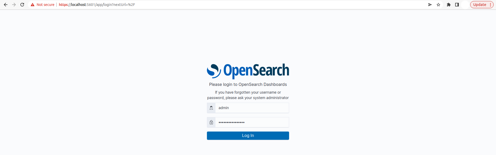
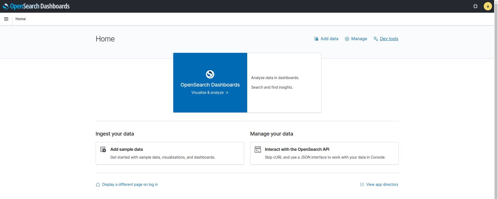
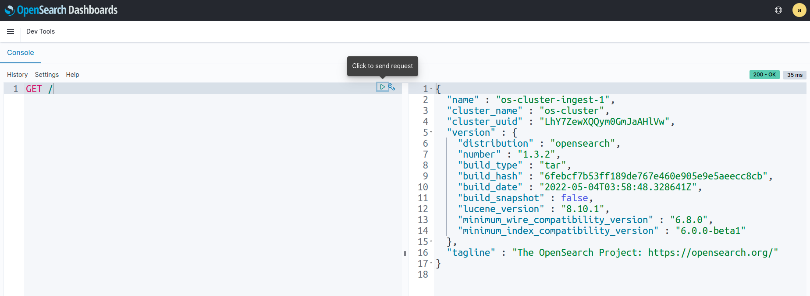
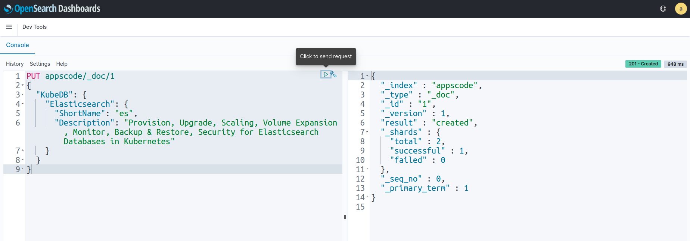
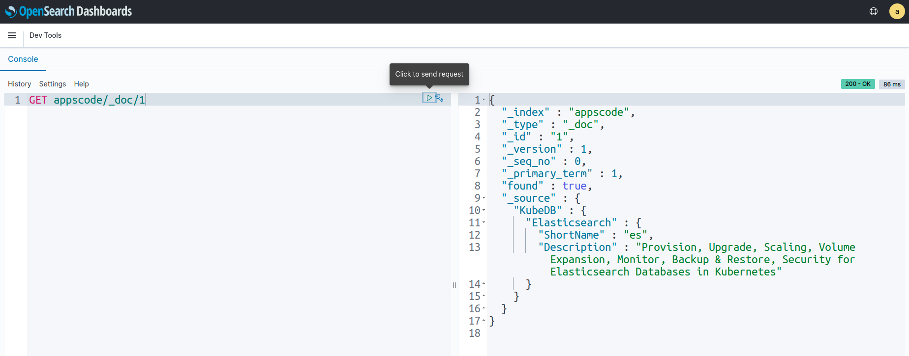
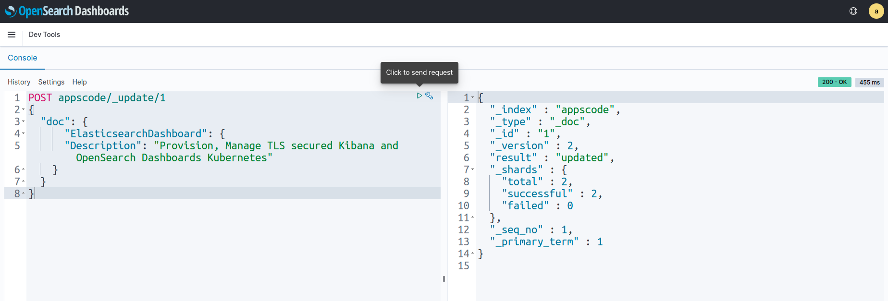
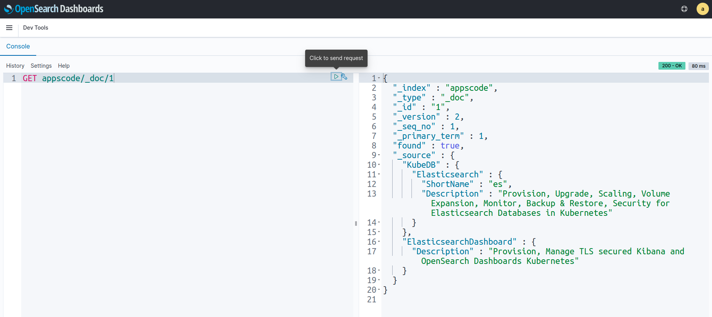
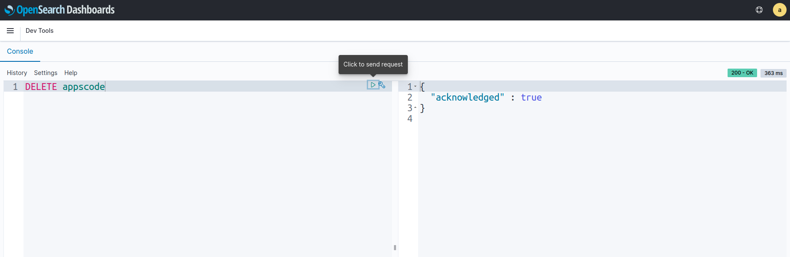

> New to KubeDB? Please start [here](/docs/README.md).

# Deploy OpenSearch-Dashboards With ElasticsearchDashboard 

## Before You Begin

At first, you need to have a Kubernetes cluster, and the `kubectl` command-line tool must be configured to communicate with your cluster. If you do not already have a cluster, you can create one by using [kind](https://kind.sigs.k8s.io/docs/user/quick-start/).

Now, install the KubeDB operator in your cluster following the steps [here](/docs/setup/README.md).

Elasticsearch has many distributions like `ElasticStack`, `OpenSearch`, `SearchGuard`, `OpenDistro` etc. KubeDB provides all of these distribution’s support under the Elasticsearch CR of KubeDB. So, we will deploy OpenSearch with the help of KubeDB managed Elasticsearch CR.

To keep things isolated, this tutorial uses a separate namespace called `demo` throughout this tutorial.

```bash
$ kubectl create namespace demo
namespace/demo created

$ kubectl get namespace
NAME                 STATUS   AGE
demo                 Active   14s
```

> Note: YAML files used in this tutorial are stored in [here](https://github.com/kubedb/docs/tree//docs/guides/elasticsearch/elasticsearch-dashboard/kibana/yamls) in GitHub repository [kubedb/docs](https://github.com/kubedb/docs).

## Find Available StorageClass

We will have to provide `StorageClass` in Elasticsearch CR specification. Check available `StorageClass` in your cluster using the following command,

```bash
$ kubectl get storageclass
NAME                 PROVISIONER             RECLAIMPOLICY   VOLUMEBINDINGMODE      ALLOWVOLUMEEXPANSION   AGE
standard (default)   rancher.io/local-path   Delete          WaitForFirstConsumer   false                  10m
```

Here, we have `standard` StorageClass in our cluster from [Local Path Provisioner](https://github.com/rancher/local-path-provisioner).

## Create an OpenSearch Cluster

We are going to create a OpenSearch Cluster in topology mode. Our cluster will be consist of 2 master nodes, 3 data nodes, 2 ingest nodes. Here, we are using Elasticsearch version ( `opensearch-2.8.0` ) of OpenSearch distribution for this demo. To learn more about the Elasticsearch CR, visit [here](/docs/guides/elasticsearch/concepts/elasticsearch/index.md).

```yaml
apiVersion: kubedb.com/v1alpha2
kind: Elasticsearch
metadata:
  name: os-cluster
  namespace: demo
spec:
  enableSSL: true 
  version: opensearch-2.8.0
  storageType: Durable
  topology:
    master:
      replicas: 2 
      storage:
        storageClassName: "standard"
        accessModes:
        - ReadWriteOnce
        resources:
          requests:
            storage: 1Gi
    data:
      replicas: 3
      storage:
        storageClassName: "standard"
        accessModes:
        - ReadWriteOnce
        resources:
          requests:
            storage: 1Gi
    ingest:
      replicas: 2
      storage:
        storageClassName: "standard"
        accessModes:
        - ReadWriteOnce
        resources:
          requests:
            storage: 1Gi
```

Here,

- `spec.version` - is the name of the ElasticsearchVersion CR. Here, we are using Elasticsearch version `opensearch-2.8.0` of OpenSearch distribution.
- `spec.enableSSL` - specifies whether the HTTP layer is secured with certificates or not.
- `spec.storageType` - specifies the type of storage that will be used for OpenSearch database. It can be `Durable` or `Ephemeral`. The default value of this field is `Durable`. If `Ephemeral` is used then KubeDB will create the OpenSearch database using `EmptyDir` volume. In this case, you don't have to specify `spec.storage` field. This is useful for testing purposes.
- `spec.topology` - specifies the node-specific properties for the OpenSearch cluster.
  - `topology.master` - specifies the properties of master nodes.
    - `master.replicas` - specifies the number of master nodes.
    - `master.storage` - specifies the master node storage information that passed to the StatefulSet.
  - `topology.data` - specifies the properties of data nodes.
    - `data.replicas` - specifies the number of data nodes.
    - `data.storage` - specifies the data node storage information that passed to the StatefulSet.
  - `topology.ingest` - specifies the properties of ingest nodes.
    - `ingest.replicas` - specifies the number of ingest nodes.
    - `ingest.storage` - specifies the ingest node storage information that passed to the StatefulSet.

Let's deploy the above yaml by the following command:

```bash
$ kubectl apply -f https://github.com/kubedb/docs/raw//docs/guides/elasticsearch//elasticsearch-dashboard/opensearch/yamls/os-cluster.yaml
elasticsearch.kubedb.com/os-cluster created
```
KubeDB will create the necessary resources to deploy the OpenSearch cluster according to the above specification. Let’s wait until the database to be ready to use,

```bash
$ watch kubectl get elasticsearch -n demo
NAME         VERSION            STATUS   AGE
os-cluster   opensearch-2.8.0   Ready    3m25s
```
Here, OpenSearch is in `Ready` state. It means the database is ready to accept connections.

Describe the object to observe the progress if something goes wrong or the status is not changing for a long period of time:

```bash
$ kubectl describe elasticsearch -n demo os-cluster
Name:         os-cluster
Namespace:    demo
Labels:       <none>
Annotations:  <none>
API Version:  kubedb.com/v1alpha2
Kind:         Elasticsearch
Metadata:
  Creation Timestamp:  2022-06-08T06:01:54Z
  Finalizers:
    kubedb.com
  Generation:  1
  Resource Version:  1012763
  UID:               2aeef9b3-fcb6-47c8-9df0-54a4fa018413
Spec:
  Auth Secret:
    Name:                os-cluster-admin-cred
  Enable SSL:            true
  Heap Size Percentage:  50
  Internal Users:
    Admin:
      Backend Roles:
        admin
      Reserved:     true
      Secret Name:  os-cluster-admin-cred
    Kibanaro:
      Secret Name:  os-cluster-kibanaro-cred
    Kibanaserver:
      Reserved:     true
      Secret Name:  os-cluster-kibanaserver-cred
    Logstash:
      Secret Name:  os-cluster-logstash-cred
    Readall:
      Secret Name:  os-cluster-readall-cred
    Snapshotrestore:
      Secret Name:  os-cluster-snapshotrestore-cred
  Kernel Settings:
    Privileged:  true
    Sysctls:
      Name:   vm.max_map_count
      Value:  262144
  Pod Template:
    Controller:
    Metadata:
    Spec:
      Affinity:
        Pod Anti Affinity:
          Preferred During Scheduling Ignored During Execution:
            Pod Affinity Term:
              Label Selector:
                Match Expressions:
                  Key:       ${NODE_ROLE}
                  Operator:  Exists
                Match Labels:
                  app.kubernetes.io/instance:    os-cluster
                  app.kubernetes.io/managed-by:  kubedb.com
                  app.kubernetes.io/name:        elasticsearches.kubedb.com
              Namespaces:
                demo
              Topology Key:  kubernetes.io/hostname
            Weight:          100
            Pod Affinity Term:
              Label Selector:
                Match Expressions:
                  Key:       ${NODE_ROLE}
                  Operator:  Exists
                Match Labels:
                  app.kubernetes.io/instance:    os-cluster
                  app.kubernetes.io/managed-by:  kubedb.com
                  app.kubernetes.io/name:        elasticsearches.kubedb.com
              Namespaces:
                demo
              Topology Key:  failure-domain.beta.kubernetes.io/zone
            Weight:          50
      Container Security Context:
        Capabilities:
          Add:
            IPC_LOCK
            SYS_RESOURCE
        Privileged:  false
      Resources:
      Service Account Name:  os-cluster
  Storage Type:              Durable
  Termination Policy:        Delete
  Tls:
    Certificates:
      Alias:  ca
      Private Key:
        Encoding:   PKCS8
      Secret Name:  os-cluster-ca-cert
      Subject:
        Organizations:
          kubedb
      Alias:  transport
      Private Key:
        Encoding:   PKCS8
      Secret Name:  os-cluster-transport-cert
      Subject:
        Organizations:
          kubedb
      Alias:  admin
      Private Key:
        Encoding:   PKCS8
      Secret Name:  os-cluster-admin-cert
      Subject:
        Organizations:
          kubedb
      Alias:  http
      Private Key:
        Encoding:   PKCS8
      Secret Name:  os-cluster-http-cert
      Subject:
        Organizations:
          kubedb
      Alias:  client
      Private Key:
        Encoding:   PKCS8
      Secret Name:  os-cluster-client-cert
      Subject:
        Organizations:
          kubedb
  Topology:
    Data:
      Replicas:  3
      Resources:
        Limits:
          Memory:  1Gi
        Requests:
          Cpu:     100m
          Memory:  1Gi
      Storage:
        Access Modes:
          ReadWriteOnce
        Resources:
          Requests:
            Storage:         1Gi
        Storage Class Name:  standard
      Suffix:                data
    Ingest:
      Replicas:  2
      Resources:
        Limits:
          Memory:  1Gi
        Requests:
          Cpu:     100m
          Memory:  1Gi
      Storage:
        Access Modes:
          ReadWriteOnce
        Resources:
          Requests:
            Storage:         1Gi
        Storage Class Name:  standard
      Suffix:                ingest
    Master:
      Replicas:  2
      Resources:
        Limits:
          Memory:  1Gi
        Requests:
          Cpu:     100m
          Memory:  1Gi
      Storage:
        Access Modes:
          ReadWriteOnce
        Resources:
          Requests:
            Storage:         1Gi
        Storage Class Name:  standard
      Suffix:                master
  Version:                   opensearch-2.8.0
Status:
  Conditions:
    Last Transition Time:  2022-06-08T06:01:54Z
    Message:               The KubeDB operator has started the provisioning of Elasticsearch: demo/os-cluster
    Reason:                DatabaseProvisioningStartedSuccessfully
    Status:                True
    Type:                  ProvisioningStarted
    Last Transition Time:  2022-06-08T06:05:02Z
    Message:               All desired replicas are ready.
    Reason:                AllReplicasReady
    Status:                True
    Type:                  ReplicaReady
    Last Transition Time:  2022-06-08T06:06:52Z
    Message:               The Elasticsearch: demo/os-cluster is accepting client requests.
    Observed Generation:   1
    Reason:                DatabaseAcceptingConnectionRequest
    Status:                True
    Type:                  AcceptingConnection
    Last Transition Time:  2022-06-08T06:11:58Z
    Message:               The Elasticsearch: demo/os-cluster is ready.
    Observed Generation:   1
    Reason:                ReadinessCheckSucceeded
    Status:                True
    Type:                  Ready
    Last Transition Time:  2022-06-08T06:06:53Z
    Message:               The Elasticsearch: demo/os-cluster is successfully provisioned.
    Observed Generation:   1
    Reason:                DatabaseSuccessfullyProvisioned
    Status:                True
    Type:                  Provisioned
  Observed Generation:     1
  Phase:                   Ready
Events:
  Type    Reason      Age   From             Message
  ----    ------      ----  ----             -------
  Normal  Successful  12m   KubeDB Operator  Successfully  governing service
  Normal  Successful  12m   KubeDB Operator  Successfully  governing service

```
- Here, in `Status.Conditions` 
  - `Conditions.Status` is `True` for the `Condition.Type:ProvisioningStarted` which means database provisioning has been started successfully.
  - `Conditions.Status` is `True` for the `Condition.Type:ReplicaReady` which specifies all replicas are ready in the cluster.
  - `Conditions.Status` is `True` for the `Condition.Type:AcceptingConnection` which means database has been accepting connection request.
  - `Conditions.Status` is `True` for the `Condition.Type:Ready` which defines database is ready to use.
  - `Conditions.Status` is `True` for the `Condition.Type:Provisioned` which specifies Database has been successfully provisioned.

### KubeDB Operator Generated Resources

After the deployment, the operator creates the following resources::

```bash
$ kubectl get all,secret,pvc -n demo -l 'app.kubernetes.io/instance=os-cluster'
NAME                      READY   STATUS    RESTARTS   AGE
pod/os-cluster-data-0     1/1     Running   0          16m
pod/os-cluster-data-1     1/1     Running   0          16m
pod/os-cluster-data-2     1/1     Running   0          16m
pod/os-cluster-ingest-0   1/1     Running   0          16m
pod/os-cluster-ingest-1   1/1     Running   0          16m
pod/os-cluster-master-0   1/1     Running   0          16m
pod/os-cluster-master-1   1/1     Running   0          16m

NAME                        TYPE        CLUSTER-IP      EXTERNAL-IP   PORT(S)    AGE
service/os-cluster          ClusterIP   10.96.203.204   <none>        9200/TCP   16m
service/os-cluster-master   ClusterIP   None            <none>        9300/TCP   16m
service/os-cluster-pods     ClusterIP   None            <none>        9200/TCP   16m

NAME                                 READY   AGE
statefulset.apps/os-cluster-data     3/3     16m
statefulset.apps/os-cluster-ingest   2/2     16m
statefulset.apps/os-cluster-master   2/2     16m

NAME                                            TYPE                       VERSION   AGE
appbinding.appcatalog.appscode.com/os-cluster   kubedb.com/elasticsearch   1.3.2     16m

NAME                                     TYPE                       DATA   AGE
secret/os-cluster-admin-cert             kubernetes.io/tls          3      16m
secret/os-cluster-admin-cred             kubernetes.io/basic-auth   2      16m
secret/os-cluster-ca-cert                kubernetes.io/tls          2      16m
secret/os-cluster-client-cert            kubernetes.io/tls          3      16m
secret/os-cluster-config                 Opaque                     3      16m
secret/os-cluster-http-cert              kubernetes.io/tls          3      16m
secret/os-cluster-kibanaro-cred          kubernetes.io/basic-auth   2      16m
secret/os-cluster-kibanaserver-cred      kubernetes.io/basic-auth   2      16m
secret/os-cluster-logstash-cred          kubernetes.io/basic-auth   2      16m
secret/os-cluster-readall-cred           kubernetes.io/basic-auth   2      16m
secret/os-cluster-snapshotrestore-cred   kubernetes.io/basic-auth   2      16m
secret/os-cluster-transport-cert         kubernetes.io/tls          3      16m

NAME                                             STATUS   VOLUME                                     CAPACITY   ACCESS MODES   STORAGECLASS   AGE
persistentvolumeclaim/data-os-cluster-data-0     Bound    pvc-eca004d5-b67f-4f39-95df-5fb311b75dc7   1Gi        RWO            standard       16m
persistentvolumeclaim/data-os-cluster-data-1     Bound    pvc-9319bcac-1e71-4414-a20e-4784f936bd3c   1Gi        RWO            standard       16m
persistentvolumeclaim/data-os-cluster-data-2     Bound    pvc-f1625b72-1b5c-4e4a-b1cf-231fb9e259e9   1Gi        RWO            standard       16m
persistentvolumeclaim/data-os-cluster-ingest-0   Bound    pvc-fe3b6633-bd74-465c-8732-9398417bec5a   1Gi        RWO            standard       16m
persistentvolumeclaim/data-os-cluster-ingest-1   Bound    pvc-2f60eea0-2bb8-4e42-a8e2-49232163f0a5   1Gi        RWO            standard       16m
persistentvolumeclaim/data-os-cluster-master-0   Bound    pvc-59e14a54-6311-4639-9b00-dca6304ed90c   1Gi        RWO            standard       16m
persistentvolumeclaim/data-os-cluster-master-1   Bound    pvc-37783550-3c3a-4280-b9ac-9e967ab248af   1Gi        RWO            standard       16m
```

- `StatefulSet` - 3 StatefulSets are created for 3 type of nodes. The StatefulSets are named after the OpenSearch instance with given suffix: `{OpenSearch-Name}-{Sufix}`.
- `Services` -  3 services are generated for each OpenSearch database.
  - `{OpenSearch-Name}` - the client service which is used to connect to the database. It points to the `ingest` nodes.
  - `{OpenSearch-Name}-master` - the master service which is used to connect to the master nodes. It is a headless service.
  - `{OpenSearch-Name}-pods` - the node discovery service which is used by the OpenSearch nodes to communicate each other. It is a headless service.
- `AppBinding` - an [AppBinding](/docs/guides/elasticsearch/concepts/appbinding/index.md) which hold the connect information for the database.
- `Secrets` - 3 types of secrets are generated for each OpenSearch database.
  - `{OpenSearch-Name}-{username}-cred` - the auth secrets which hold the `username` and `password` for the OpenSearch users.
  - `{OpenSearch-Name}-{alias}-cert` - the certificate secrets which hold `tls.crt`, `tls.key`, and `ca.crt` for configuring the OpenSearch database.
  - `{OpenSearch-Name}-config` - the default configuration secret created by the operator.

## Deploy ElasticsearchDashboard

```yaml
apiVersion: elasticsearch.kubedb.com/v1alpha1
kind: ElasticsearchDashboard
metadata:
  name: os-cluster-dashboard
  namespace: demo
spec:
  enableSSL: true
  databaseRef:
    name: os-cluster
  terminationPolicy: WipeOut
```
> Note: OpenSearch Database and OpenSearch dashboard should have to be deployed in the same namespace. In this tutorial, we use `demo` namespace for both cases.

- `spec.enableSSL` specifies whether the HTTP layer is secured with certificates or not.
- `spec.databaseRef.name` refers to the OpenSearch database name.
- `spec.terminationPolicy` refers to the strategy to follow during dashboard deletion. `Wipeout` means that the database will be deleted without restrictions. It can also be `DoNotTerminate` which will cause a restriction to delete the dashboard. Learn More about these [HERE](https://kubedb.com/docs/v2022.05.24/guides/elasticsearch/concepts/elasticsearch/#specterminationpolicy).

Let's deploy the above yaml by the following command:

```bash
$ kubectl apply -f https://github.com/kubedb/docs/raw//docs/guides/elasticsearch/elasticsearch-dashboard/opensearch/yamls/os-cluster-dashboard.yaml
elasticsearchdashboard.dashboard.kubedb.com/os-cluster-dashboard created
```

KubeDB will create the necessary resources to deploy the OpenSearch dashboard according to the above specification. Let’s wait until the dashboard to be ready to use,

```bash
$ watch kubectl get elasticsearchdashboard -n demo
NAME                   TYPE                            DATABASE     STATUS   AGE
os-cluster-dashboard   dashboard.kubedb.com/v1alpha1   os-cluster   Ready    9m
```
Here, OpenSearch Dashboard is in `Ready` state. 


## Connect with OpenSearch Dashboard

We will use [port forwarding](https://kubernetes.io/docs/tasks/access-application-cluster/port-forward-access-application-cluster/) to connect with our OpenSearch database. Then we will use `curl` to send `HTTP` requests to check cluster health to verify that our OpenSearch database is working well.

#### Port-forward the Service

KubeDB will create few Services to connect with the database. Let’s check the Services by following command,

```bash
$ kubectl get service -n demo
NAME                   TYPE        CLUSTER-IP      EXTERNAL-IP   PORT(S)    AGE
os-cluster             ClusterIP   10.96.103.250   <none>        9200/TCP   19m
os-cluster-dashboard   ClusterIP   10.96.108.252   <none>        5601/TCP   19m
os-cluster-master      ClusterIP   None            <none>        9300/TCP   19m
os-cluster-pods        ClusterIP   None            <none>        9200/TCP   19m

```
Here, we are going to use `os-cluster-dashboard` Service to connect with the database. Now, let’s port-forward the `os-cluster` Service to the port `5601` to local machine:

```bash
$ kubectl port-forward -n demo service/os-cluster-dashboard 5601
Forwarding from 127.0.0.1:5601 -> 5601
Forwarding from [::1]:5601 -> 5601
```
Now, our OpenSearch cluster dashboard is accessible at `https://localhost:5601`.

#### Export the Credentials

KubeDB also create some Secrets for the database. Let’s check which Secrets have been created by KubeDB for our `os-cluster`.

```bash
$ kubectl get secret -n demo | grep es-cluster
os-cluster-admin-cert              kubernetes.io/tls                     3      16m
os-cluster-admin-cred              kubernetes.io/basic-auth              2      16m
os-cluster-ca-cert                 kubernetes.io/tls                     2      16m
os-cluster-client-cert             kubernetes.io/tls                     3      16m
os-cluster-config                  Opaque                                3      16m
os-cluster-dashboard-ca-cert       kubernetes.io/tls                     2      8m31s
os-cluster-dashboard-config        Opaque                                2      8m30s
os-cluster-dashboard-server-cert   kubernetes.io/tls                     3      8m30s
os-cluster-http-cert               kubernetes.io/tls                     3      16m
os-cluster-kibanaro-cred           kubernetes.io/basic-auth              2      16m
os-cluster-kibanaserver-cred       kubernetes.io/basic-auth              2      16m
os-cluster-logstash-cred           kubernetes.io/basic-auth              2      16m
os-cluster-readall-cred            kubernetes.io/basic-auth              2      16m
os-cluster-snapshotrestore-cred    kubernetes.io/basic-auth              2      16m
os-cluster-token-wq8b9             kubernetes.io/service-account-token   3      16m
os-cluster-transport-cert          kubernetes.io/tls                     3      16m
```
Now, we can connect to the database with `os-cluster-elastic-cred` which contains the admin credentials to connect with the database.

### Accessing Database Through Dashboard

To access the database through Dashboard, we have to get the credentials. We can do that by following command,

```bash
$ kubectl get secret -n demo os-cluster-admin-cred -o jsonpath='{.data.username}' | base64 -d
admin
$ kubectl get secret -n demo os-cluster-admin-cred -o jsonpath='{.data.password}' | base64 -d
Oyj8FdPzA.DZqEyS
```

Now, let's go to `https://localhost:5601` from our browser and login by using those credentials.



After login successfully, we will see OpenSearch Dashboard UI. Now, We are going to `Dev tools` for running some queries into our OpenSearch database.



Here, in `Dev tools` we will use `Console` section for running some queries. Let's run `GET /` query to check node informations.



Now, we are going to insert some sample data to our OpenSearch cluster index `appscode/_doc/1` by using `PUT` query.



Let's check that sample data in the index `appscode/_doc/1` by using `GET` query.



Now, we are going to update sample data in the index `appscode/_doc/1` by using `POST` query.



Let's verify the index `appscode/_doc/1` again to see whether the data is updated or not.



We can see that the data has been updated successfully.
Now, Let's remove that index by using `DELETE` query.




## Cleaning Up

To cleanup the Kubernetes resources created by this tutorial, run:

```bash
$ kubectl delete elasticsearchdashboard -n demo os-cluster-dashboard

$ kubectl patch -n demo elasticsearch os-cluster -p '{"spec":{"terminationPolicy":"WipeOut"}}' --type="merge"

$ kubectl delete elasticsearch -n demo os-cluster 

# Delete namespace
$ kubectl delete namespace demo
```

## Next Steps

- Learn about [taking backup](/docs/guides/elasticsearch/backup/overview/index.md) of Elasticsearch database using Stash.
- Detail concepts of [Elasticsearch object](/docs/guides/elasticsearch/concepts/elasticsearch/index.md).
- Use [private Docker registry](/docs/guides/elasticsearch/private-registry/using-private-registry.md) to deploy Elasticsearch with KubeDB.
- Want to hack on KubeDB? Check our [contribution guidelines](/docs/CONTRIBUTING.md).
