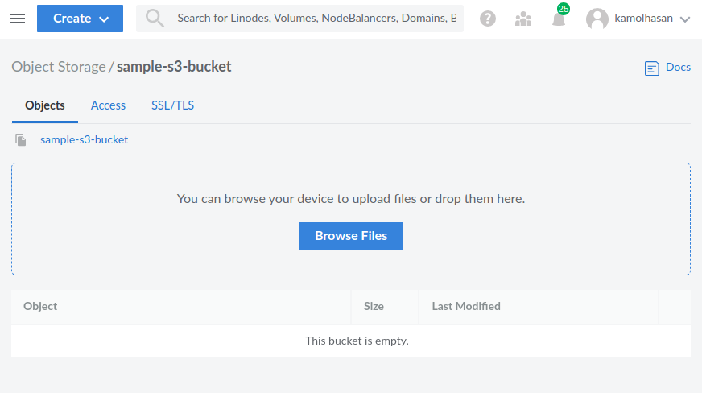

> New to KubeDB? Please start [here](/docs/README.md).

# Snapshot and Restore Using S3 Repository Plugin

The [S3 repository](https://www.elastic.co/guide/en/elasticsearch/plugins/7.14/repository-s3.html) plugin adds support for using AWS S3 as a repository for Snapshot/Restore. It also works with S3 compatible other mediums such as [Linode Object Storage](https://www.linode.com/docs/guides/how-to-use-object-storage/).

For the demo, we are going to show you how to snapshot a KubeDB managed Elasticsearch and restore data from previously taken snapshot.

## Before You Begin

At first, you need to have a Kubernetes cluster, and the `kubectl` command-line tool must be configured to communicate with your cluster. If you do not already have a cluster, you can create one by using [kind](https://kind.sigs.k8s.io/docs/user/quick-start/).

Now, install the KubeDB operator in your cluster following the steps [here](/docs/setup/README.md).

To keep things isolated, this tutorial uses a separate namespace called `demo` throughout this tutorial.

```bash
$ kubectl create namespace demo
namespace/demo created

$ kubectl get namespace
NAME                 STATUS   AGE
demo                 Active   9s
```

> Note: YAML files used in this tutorial are stored in [guides/elasticsearch/quickstart/overview/yamls](https://github.com/kubedb/docs/tree//docs/guides/elasticsearch/plugins-backup/s3-repository/yamls) folder in GitHub repository [kubedb/docs](https://github.com/kubedb/docs)

## Create S3 Compatible Storage

We are going to use the [Linode Object Storage](https://www.linode.com/docs/guides/how-to-use-object-storage/) which is S3 compatible. But you can any S3 compatible storage which suits you best. Let's [create](https://cloud.linode.com/object-storage/buckets/create) a `sample-s3-bucket` to store snapshot and later restore from it.



You also need to [create](https://cloud.linode.com/object-storage/access-keys) `access_key` and `secret_key` so that your Elasticsearch Cluster can connect to the bucket.

## Deploy Elasticsearch Cluster and Populate Data

For the demo, we are going to use Elasticsearch docker images from KubeDB distribution with the pre-installed S3 repository plugin. 

### Secure Client Settings

To make the plugin works we need to create a k8s secret with the Elastisearch secure settings:

```yaml
apiVersion: v1
kind: Secret
metadata:
  name: es-secure-settings
  namespace: demo
stringData:
  password: strong-password
  s3.client.default.access_key: 6BU5GFIIUC2********
  s3.client.default.secret_key: DD1FS5NAiPf********
```

> N.B.: Here, the `password` is the Elasticsearch `KEYSTROE_PASSWORD`, if you do not provide it, default to empty string (`""`).

Let's create the k8s secret with secure settings:

```bash
$ kubectl apply -f secure-settings-secret.yaml
secret/es-secure-settings created
```

In [S3 Client Settings](https://www.elastic.co/guide/en/elasticsearch/plugins/7.14/repository-s3-client.html), If you do not configure the `endpoint`, it default to `s3.amazonaws.com`. Since we are using Linode Bucket instead of AWS S3, we need to configure the endpoint too. Let's create another secret with custom client configurations:

```yaml
apiVersion: v1
kind: Secret
metadata:
  name: es-custom-config
  namespace: demo
stringData:
  elasticsearch.yml: |-
    s3.client.default.endpoint: us-east-1.linodeobjects.com
```

> N.B.: In Elasticsearch, only secure setting goes to `elasticsearch.keystore`, others are put into `elasticsearch.yml` config file. That's why two different k8s secrets are used.

Let's create the k8s secret with custom configurations:

```bash
$ kubectl apply -f custom-configuration.yaml
secret/es-custom-config created
```

### Deploy Elasticsearch Cluster

Now that we have deployed our configuration secrets, it's time to deploy our Elasticsearch instance.

```yaml
apiVersion: kubedb.com/v1alpha2
kind: Elasticsearch
metadata:
  name: sample-es
  namespace: demo
spec:
  # Custom configuration, which will update elasticsearch.yml
  configSecret:
    name: es-custom-config
  # Secure settings which will be stored in elasticsearch.keystore
  secureConfigSecret:
    name: es-secure-settings
  enableSSL: true
  # we are using ElasticsearchVersion with pre-installed s3 repository plugin
  version: xpack-8.11.1
  storageType: Durable
  replicas: 3
  storage:
    storageClassName: "standard"
    accessModes:
    - ReadWriteOnce
    resources:
      requests:
        storage: 1Gi
```

Let's deploy the Elasticsearch and wait for it to become ready to use:

```bash
$ kubectl apply -f https://github.com/kubedb/docs/raw//docs/guides/elasticsearch/plugins-backup/s3-repository/yamls/elasticsearch.yaml
elasticsearch.kubedb.com/sample-es created
```

```bash
$ kubectl get es -n demo -w
NAME        VERSION               STATUS   AGE
sample-es   xpack-8.11.1            0s
sample-es   xpack-8.11.1   Provisioning   19s
sample-es   xpack-8.11.1   Ready          41s
```

### Populate Data

To connect to our Elasticsearch cluster, let's port-forward the Elasticsearch service to local machine:

```bash
$ kubectl port-forward -n demo svc/sample-es 9200
Forwarding from 127.0.0.1:9200 -> 9200
Forwarding from [::1]:9200 -> 9200
```

Keep it like that and switch to another terminal window:

```bash
$ export ELASTIC_USER=$(kubectl get secret -n demo sample-es-elastic-cred -o jsonpath='{.data.username}' | base64 -d)

$ export ELASTIC_PASSWORD=$(kubectl get secret -n demo sample-es-elastic-cred -o jsonpath='{.data.password}' | base64 -d)

$ curl -XGET -k -u  "$ELASTIC_USER:$ELASTIC_PASSWORD" "https://localhost:9200/_cluster/health?pretty"
{
  "cluster_name" : "sample-es",
  "status" : "green",
  "timed_out" : false,
  "number_of_nodes" : 3,
  "number_of_data_nodes" : 3,
  "active_primary_shards" : 1,
  "active_shards" : 2,
  "relocating_shards" : 0,
  "initializing_shards" : 0,
  "unassigned_shards" : 0,
  "delayed_unassigned_shards" : 0,
  "number_of_pending_tasks" : 0,
  "number_of_in_flight_fetch" : 0,
  "task_max_waiting_in_queue_millis" : 0,
  "active_shards_percent_as_number" : 100.0
}
```

So, our cluster status is green. Let's create some indices with dummy data:

```bash
$ curl -XPOST -k -u  "$ELASTIC_USER:$ELASTIC_PASSWORD" "https://localhost:9200/products/_doc?pretty" -H 'Content-Type: application/json' -d '
{
    "name": "KubeDB",
    "vendor": "AppsCode Inc.",
    "description": "Database Operator for Kubernetes"
}
'

$ curl -XPOST -k -u  "$ELASTIC_USER:$ELASTIC_PASSWORD" "https://localhost:9200/companies/_doc?pretty" -H 'Content-Type: application/json' -d '
{
    "name": "AppsCode Inc.",
    "mission": "Accelerate the transition to Containers by building a Kubernetes-native Data Platform",
    "products": ["KubeDB", "Stash", "KubeVault", "Kubeform", "ByteBuilders"]
}
'
```

Now, let’s verify that the indexes have been created successfully.

```bash
$ curl -XGET -k -u  "$ELASTIC_USER:$ELASTIC_PASSWORD" "https://localhost:9200/_cat/indices?v&s=index&pretty"
health status index            uuid                   pri rep docs.count docs.deleted store.size pri.store.size
green  open   .geoip_databases oiaZfJA8Q5CihQon0oR8hA   1   1         42            0     81.6mb         40.8mb
green  open   companies        GuGisWJ8Tkqnq8vhREQ2-A   1   1          1            0     11.5kb          5.7kb
green  open   products         wyu-fImDRr-Hk_GXVF7cDw   1   1          1            0     10.6kb          5.3kb
```

### Repository Settings

The s3 repository type supports a [number of settings](https://www.elastic.co/guide/en/elasticsearch/plugins/7.14/repository-s3-repository.html#repository-s3-repository) to customize how data is stored in S3. These can be specified when creating the repository.

Let's create the `_snapshot` repository `sample_s3_repo` with our bucket name `sample-s3-bucket`:

```bash
$ curl -k -X PUT -u  "$ELASTIC_USER:$ELASTIC_PASSWORD" "https://localhost:9200/_snapshot/sample_s3_repo?pretty" -H 'Content-Type: application/json' -d'
{
  "type": "s3",
  "settings": {
    "bucket": "sample-s3-bucket"
  }
}
'
{
  "acknowledged" : true
}
```

We've successfully created our repository. Ready to take our first snapshot.

## Create a Snapshot

A repository can contain multiple snapshots of the same cluster. Snapshots are identified by unique names within the cluster. For more details, visit [Create a snapshot](https://www.elastic.co/guide/en/elasticsearch/reference/7.14/snapshots-take-snapshot.html).

```bash
$ curl -k -X PUT -u  "$ELASTIC_USER:$ELASTIC_PASSWORD" "https://localhost:9200/_snapshot/sample_s3_repo/snapshot_1?wait_for_completion=true&pretty"

{
  "snapshot" : {
    "snapshot" : "snapshot_1",
    "uuid" : "JKoF5sgtS3WPBQ8A_OvWbw",
    "repository" : "sample_s3_repo",
    "version_id" : 7140099,
    "version" : "7.14.0",
    "indices" : [
      ".geoip_databases",
      "companies",
      "products"
    ],
    "data_streams" : [ ],
    "include_global_state" : true,
    "state" : "SUCCESS",
    "start_time" : "2021-08-24T14:45:38.930Z",
    "start_time_in_millis" : 1629816338930,
    "end_time" : "2021-08-24T14:46:16.946Z",
    "end_time_in_millis" : 1629816376946,
    "duration_in_millis" : 38016,
    "failures" : [ ],
    "shards" : {
      "total" : 3,
      "failed" : 0,
      "successful" : 3
    },
    "feature_states" : [
      {
        "feature_name" : "geoip",
        "indices" : [
          ".geoip_databases"
        ]
      }
    ]
  }
}
```

We've successfully taken our first snapshot.

## Delete Data and Restore a Snapshot

Let's delete all the indices:

```bash
$ curl -k -u "$ELASTIC_USER:$ELASTIC_PASSWORD" -X DELETE "https://localhost:9200/_all?pretty"
{
  "acknowledged" : true
}
```

List and varify the deletion:

```bash
$ curl -XGET -k -u  "$ELASTIC_USER:$ELASTIC_PASSWORD" "https://localhost:9200/_cat/indices?v&s=index&pretty"
health status index            uuid                   pri rep docs.count docs.deleted store.size pri.store.size
green  open   .geoip_databases oiaZfJA8Q5CihQon0oR8hA   1   1         42            0     81.6mb         40.8mb
```

For more details about restore, visit [Restore a snapshot](https://www.elastic.co/guide/en/elasticsearch/reference/7.14/snapshots-restore-snapshot.html#snapshots-restore-snapshot).

Let's restore the data from our `snapshot_1`:

```bash
$ curl -k -u "$ELASTIC_USER:$ELASTIC_PASSWORD" -X POST "https://localhost:9200/_snapshot/sample_s3_repo/snapshot_1/_restore?pretty" -H 'Content-Type: application/json' -d'
{
  "indices": "companies,products"
}
'

{
  "accepted" : true
}
```

We've successfully restored our indices.

> N.B.: We only wanted to restore the indices we created, but if you want to overwrite everything with the snapshot data, you can do it by setting `include_global_state` to `true` while restoring.

### Varify Data

To varify our data, let's list the indices:

```bash
$ curl -XGET -k -u  "$ELASTIC_USER:$ELASTIC_PASSWORD" "https://localhost:9200/_cat/indices?v&s=index&pretty"
health status index            uuid                   pri rep docs.count docs.deleted store.size pri.store.size
green  open   .geoip_databases oiaZfJA8Q5CihQon0oR8hA   1   1         42            0     81.6mb         40.8mb
green  open   companies        drsv-5tvQwCcte7bkUT0uQ   1   1          1            0     11.7kb          5.8kb
green  open   products         7TXoXy5kRFiVgZDuyqffQA   1   1          1            0     10.6kb          5.3kb
```

Check the content inside:

```bash
$ curl -XGET -k -u  "$ELASTIC_USER:$ELASTIC_PASSWORD" "https://localhost:9200/products/_search?pretty"
{
  "took" : 3,
  "timed_out" : false,
  "_shards" : {
    "total" : 1,
    "successful" : 1,
    "skipped" : 0,
    "failed" : 0
  },
  "hits" : {
    "total" : {
      "value" : 1,
      "relation" : "eq"
    },
    "max_score" : 1.0,
    "hits" : [
      {
        "_index" : "products",
        "_type" : "_doc",
        "_id" : "36SEeHsBS6UMHADkEvJw",
        "_score" : 1.0,
        "_source" : {
          "name" : "KubeDB",
          "vendor" : "AppsCode Inc.",
          "description" : "Database Operator for Kubernetes"
        }
      }
    ]
  }
}
```

```bash
$ curl -XGET -k -u  "$ELASTIC_USER:$ELASTIC_PASSWORD" "https://localhost:9200/companies/_search?pretty"
{
  "took" : 3,
  "timed_out" : false,
  "_shards" : {
    "total" : 1,
    "successful" : 1,
    "skipped" : 0,
    "failed" : 0
  },
  "hits" : {
    "total" : {
      "value" : 1,
      "relation" : "eq"
    },
    "max_score" : 1.0,
    "hits" : [
      {
        "_index" : "companies",
        "_type" : "_doc",
        "_id" : "4KSFeHsBS6UMHADkGvL5",
        "_score" : 1.0,
        "_source" : {
          "name" : "AppsCode Inc.",
          "mission" : "Accelerate the transition to Containers by building a Kubernetes-native Data Platform",
          "products" : [
            "KubeDB",
            "Stash",
            "KubeVault",
            "Kubeform",
            "ByteBuilders"
          ]
        }
      }
    ]
  }
}
```

So, we have successfully retored our data from the snapshot.
