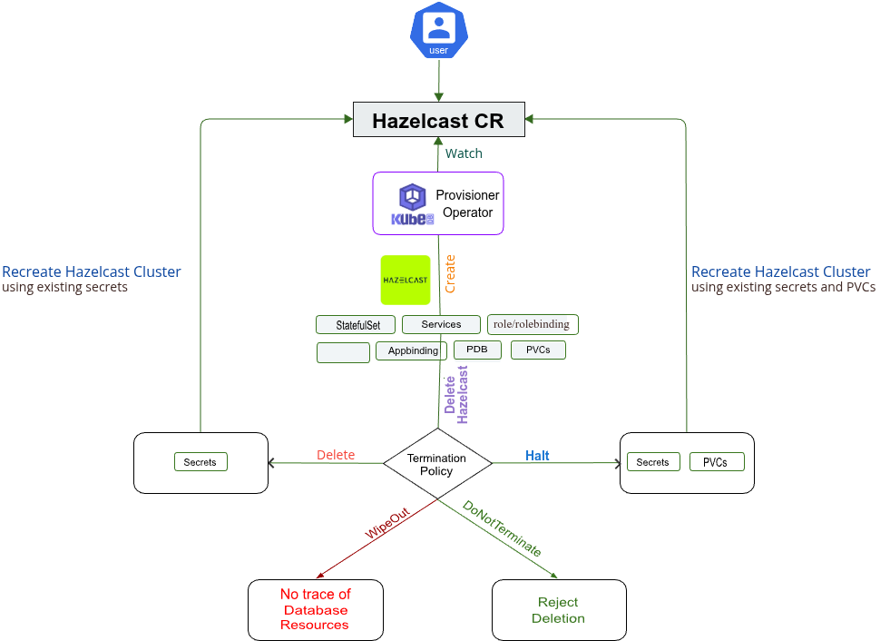

> New to KubeDB? Please start [here](/docs/README.md).

# Hazelcast QuickStart

This tutorial will show you how to use KubeDB to run a Hazelcast database.

<p align="center">
  
</p>

## Before You Begin

At first, you need to have a Kubernetes cluster, and the `kubectl` command-line tool must be configured to communicate with your cluster. If you do not already have a cluster, you can create one by using [kind](https://kind.sigs.k8s.io/docs/user/quick-start/).

Now, install the KubeDB operator in your cluster following the steps [here](/docs/setup/install/_index.md).  and make sure install with helm command including `--set global.featureGates.Hazelcast=true --set global.featureGates.ZooKeeper=true` to ensure Hazelcast and ZooKeeper crd.

To keep things isolated, this tutorial uses a separate namespace called `demo` throughout this tutorial.

```bash
$ kubectl create namespace demo
namespace/demo created

$ kubectl get namespace
NAME                 STATUS   AGE
demo                 Active   9s
```

> Note: YAML files used in this tutorial are stored in [docs/guides/hazelcast/quickstart/overview/yamls](https://github.com/kubedb/docs/tree//docs/guides/hazelcast/quickstart/overview/yamls) folder in GitHub repository [kubedb/docs](https://github.com/kubedb/docs).

> We have designed this tutorial to demonstrate a production setup of KubeDB managed Hazelcast. If you just want to try out KubeDB, you can bypass some safety features following the tips [here](/docs/guides/hazelcast/quickstart/overview/index.md#tips-for-testing).

## Find Available StorageClass

We will have to provide `StorageClass` in Hazelcast CRD specification. Check available `StorageClass` in your cluster using the following command,

```bash
$ kubectl get storageclass
NAME                 PROVISIONER             RECLAIMPOLICY   VOLUMEBINDINGMODE      ALLOWVOLUMEEXPANSION   AGE
standard (default)   rancher.io/local-path   Delete          WaitForFirstConsumer   false                  14h
```

Here, we have `standard` StorageClass in our cluster from [Local Path Provisioner](https://github.com/rancher/local-path-provisioner).

## Find Available HazelcastVersion

When you install the KubeDB operator, it registers a CRD named `HazelcastVersions`. The installation process comes with a set of tested HazelcastVersion objects. Let's check available HazelcastVersions by,

```bash
$ kubectl get hzversion
NAME    VERSION   DB_IMAGE                               DEPRECATED   AGE
5.5.2   5.5.2     hazelcast/hazelcast-enterprise:5.5.2                148m
```

Notice the `DEPRECATED` column. Here, `true` means that this HazelcastVersion is deprecated for the current KubeDB version. KubeDB will not work for deprecated HazelcastVersion.

In this tutorial, we will use `5.5.2` HazelcastVersion CR to create a Hazelcast cluster.

> Note: An image with a higher modification tag will have more features and fixes than an image with a lower modification tag. Hence, it is recommended to use HazelcastVersion CRD with the highest modification tag to take advantage of the latest features. For example, use `5.5.2`.

## Create a Hazelcast Cluster

The KubeDB operator implements a Hazelcast CRD to define the specification of a Hazelcast database.

Before deploying hazelcast we need to create license secret since we are running enterprise version of hazelcast.

```bash
kubectl create secret generic hz-license-key -n demo --from-literal=licenseKey='your hazelcast license key'
secret/hz-license-key created
```

Now we can deploy hazelcast in our cluster.

The Hazelcast instance used for this tutorial:

```yaml
apiVersion: kubedb.com/v1alpha2
kind: Hazelcast
metadata:
  name: hazelcast-sample
  namespace: demo
spec:
  deletionPolicy: WipeOut
  licenseSecret:
    name: hz-license-key
  replicas: 3
  version: 5.5.2
  storage:
    accessModes:
      - ReadWriteOnce
    resources:
      requests:
        storage: 2Gi
    storageClassName: standard

```

Here,

- `spec.version` - is the name of the HazelcastVersion CR. Here, a Hazelcast of version `5.5.2` will be created.
- `spec.replicas` - specifies the number of Hazelcast nodes.
- `spec.licenseSecret` - specifies the license created for hazelcast enterprise version.
- `spec.storageType` - specifies the type of storage that will be used for Hazelcast database. It can be `Durable` or `Ephemeral`. The default value of this field is `Durable`. If `Ephemeral` is used then KubeDB will create the Hazelcast database using `EmptyDir` volume. In this case, you don't have to specify `spec.storage` field. This is useful for testing purposes.
- `spec.storage` specifies the StorageClass of PVC dynamically allocated to store data for this database. This storage spec will be passed to the StatefulSet created by the KubeDB operator to run database pods. You can specify any StorageClass available in your cluster with appropriate resource requests. If you don't specify `spec.storageType: Ephemeral`, then this field is required.
- `spec.deletionPolicy` specifies what KubeDB should do when a user try to delete Hazelcast CR. Deletion policy `Delete` will delete the database pods, secret and PVC when the Hazelcast CR is deleted. Checkout the [link](/docs/guides/hazelcast/concepts/hazelcast.md#specdeletionpolicy) for details.

> Note: `spec.storage` section is used to create PVC for database pod. It will create PVC with storage size specified in the `storage.resources.requests` field. Don't specify `limits` here. PVC does not get resized automatically.

Let's create the Hazelcast CR that is shown above:

```bash
$ kubectl apply -f https://github.com/kubedb/docs/raw//docs/guides/hazelcast/quickstart/overview/yamls/hazelcast.yaml
hazelcast.kubedb.com/hazelcast-sample created
```

The Hazelcast's `STATUS` will go from `Provisioning` to `Ready` state within few minutes. Once the `STATUS` is `Ready`, you are ready to use the database.

```bash
$ kubectl get hazelcast -n demo
NAME               TYPE                  VERSION   STATUS   AGE
hazelcast-sample   kubedb.com/v1alpha2   5.5.2     Ready    3m

```


Describe the Hazelcast object to observe the progress if something goes wrong or the status is not changing for a long period of time:

```bash
$ kubectl describe hz hazelcast-sample -n demo
Name:         hazelcast-sample
Namespace:    demo
Labels:       <none>
Annotations:  <none>
API Version:  kubedb.com/v1alpha2
Kind:         Hazelcast
Metadata:
  Creation Timestamp:  2025-06-11T07:35:38Z
  Finalizers:
    kubedb.com
  Generation:        2
  Resource Version:  1180125
  UID:               c86fe3d3-276a-4124-a1cf-d7f5409ee61f
Spec:
  Deletion Policy:  Halt
  Health Checker:
    Failure Threshold:  3
    Period Seconds:     20
    Timeout Seconds:    10
  License Secret:
    Name:  hz-license-key
  Pod Template:
    Controller:
    Metadata:
    Spec:
      Containers:
        Liveness Probe:
          Failure Threshold:  10
          Http Get:
            Path:                 /hazelcast/health/node-state
            Port:                 5701
            Scheme:               HTTPS
          Initial Delay Seconds:  30
          Period Seconds:         10
          Success Threshold:      1
          Timeout Seconds:        10
        Name:                     hazelcast
        Readiness Probe:
          Failure Threshold:  10
          Http Get:
            Path:                 /hazelcast/health/ready
            Port:                 5701
            Scheme:               HTTPS
          Initial Delay Seconds:  30
          Period Seconds:         10
          Success Threshold:      1
          Timeout Seconds:        10
        Resources:
          Limits:
            Memory:  1536Mi
          Requests:
            Cpu:     500m
            Memory:  1536Mi
        Security Context:
          Allow Privilege Escalation:  false
          Capabilities:
            Drop:
              ALL
          Run As Non Root:  true
          Run As User:      65534
          Seccomp Profile:
            Type:  RuntimeDefault
      Init Containers:
        Name:  hazelcast-init
        Resources:
          Limits:
            Memory:  512Mi
          Requests:
            Cpu:     200m
            Memory:  256Mi
        Security Context:
          Allow Privilege Escalation:  false
          Capabilities:
            Drop:
              ALL
          Run As Non Root:  true
          Run As User:      65534
          Seccomp Profile:
            Type:  RuntimeDefault
      Pod Placement Policy:
        Name:  default
      Security Context:
        Fs Group:                        65534
      Termination Grace Period Seconds:  600
  Replicas:                              3
  Storage:
    Access Modes:
      ReadWriteOnce
    Resources:
      Requests:
        Storage:         2Gi
    Storage Class Name:  standard
  Storage Type:          Durable
  Version:        5.5.2
Status:
  Conditions:
    Last Transition Time:  2025-06-11T07:35:38Z
    Message:               The KubeDB operator has started the provisioning of Hazelcast: demo/hazelcast-sample
    Observed Generation:   1
    Reason:                DatabaseProvisioningStartedSuccessfully
    Status:                True
    Type:                  ProvisioningStarted
    Last Transition Time:  2025-06-11T07:37:58Z
    Message:               All desired replicas are ready
    Observed Generation:   2
    Reason:                AllReplicasReady
    Status:                True
    Type:                  ReplicaReady
    Last Transition Time:  2025-06-11T07:38:22Z
    Message:               The Hazelcast: demo/hazelcast-sample is accepting connection
    Observed Generation:   2
    Reason:                DatabaseAcceptingConnectionRequest
    Status:                True
    Type:                  AcceptingConnection
    Last Transition Time:  2025-06-11T07:38:22Z
    Message:               The Hazelcast: demo/hazelcast-sample is accepting write request.
    Observed Generation:   2
    Reason:                DatabaseWriteAccessCheckSucceeded
    Status:                True
    Type:                  DatabaseWriteAccess
    Last Transition Time:  2025-06-11T07:38:22Z
    Message:               The Hazelcast: demo/hazelcast-sample is ready
    Observed Generation:   2
    Reason:                AllReplicasReady,AcceptingConnection,ReadinessCheckSucceeded,DatabaseWriteAccessCheckSucceeded
    Status:                True
    Type:                  Ready
    Last Transition Time:  2025-06-11T07:38:26Z
    Message:               The Hazelcast: demo/hazelcast-sample is successfully provisioned.
    Observed Generation:   2
    Reason:                DatabaseSuccessfullyProvisioned
    Status:                True
    Type:                  Provisioned
    Last Transition Time:  2025-06-11T07:38:42Z
    Message:               The Hazelcast: demo/hazelcast-sample is accepting read request.
    Observed Generation:   2
    Reason:                DatabaseReadAccessCheckSucceeded
    Status:                True
    Type:                  DatabaseReadAccess
  Phase:                   Ready
Events:                    <none>
```

### KubeDB Operator Generated Resources

On deployment of a Hazelcast CR, the operator creates the following resources:

```bash
$ kubectl get all,secret,pvc -n demo -l 'app.kubernetes.io/instance=hazelcast-sample'
NAME                     READY   STATUS    RESTARTS   AGE
pod/hazelcast-sample-0   1/1     Running   0          76m
pod/hazelcast-sample-1   1/1     Running   0          75m
pod/hazelcast-sample-2   1/1     Running   0          74m

NAME                            TYPE        CLUSTER-IP     EXTERNAL-IP   PORT(S)    AGE
service/hazelcast-sample        ClusterIP   10.43.228.92   <none>        5701/TCP   76m
service/hazelcast-sample-pods   ClusterIP   None           <none>        5701/TCP   76m

NAME                                READY   AGE
statefulset.apps/hazelcast-sample   3/3     76m

NAME                                                  TYPE                   VERSION   AGE
appbinding.appcatalog.appscode.com/hazelcast-sample   kubedb.com/hazelcast   5.5.2     76m

NAME                                    TYPE                       DATA   AGE
secret/hazelcast-sample-auth            kubernetes.io/basic-auth   2      88m
secret/hazelcast-sample-config          Opaque                     2      76m

NAME                                                             STATUS   VOLUME                                     CAPACITY   ACCESS MODES   STORAGECLASS   VOLUMEATTRIBUTESCLASS   AGE
persistentvolumeclaim/hazelcast-sample-data-hazelcast-sample-0   Bound    pvc-d88feaed-2680-44f5-b2ac-5f5ec8216db8   2Gi        RWO            standard       <unset>                 76m
persistentvolumeclaim/hazelcast-sample-data-hazelcast-sample-1   Bound    pvc-970da06b-a76e-442f-8350-97603efbe9df   2Gi        RWO            standard       <unset>                 75m
persistentvolumeclaim/hazelcast-sample-data-hazelcast-sample-2   Bound    pvc-3bd48f9c-14f9-40af-ba5d-1e0ed6538722   2Gi        RWO            standard       <unset>                 74m 
```

- `StatefulSet` - a StatefulSet named after the Hazelcast instance. In topology mode, the operator creates 3 PetSets with name `{Hazelcast-Name}`.
- `Services` -  2 services are generated for each Hazelcast database.
    - `{Hazelcast-Name}` - the client service which is used to connect to the database. It points to the `overseer` nodes.
    - `{Hazelcast-Name}-pods` - the node discovery service which is used by the Hazelcast nodes to communicate each other. It is a headless service.
- `AppBinding` - an [AppBinding](/docs/guides/hazelcast/concepts/appbinding.md) which hold to connect information for the database. It is also named after the hazelcast instance.
- `Secrets` - 3 types of secrets are generated for each Hazelcast database.
    - `{Hazelcast-Name}-auth` - the auth secrets which hold the `username` and `password` for the hazelcast users. The auth secret `hazelcast-sample-auth` holds the `username` and `password` for `admin` user which lets administrative access.
    - `{Hazelcast-Name}-config` - the default configuration secret created by the operator.

## Connect with Hazelcast Database

We will use [port forwarding](https://kubernetes.io/docs/tasks/access-application-cluster/port-forward-access-application-cluster/) to connect with our Hazelcast database. Then we will use `curl` to send `HTTP` requests to check cluster health to verify that our Hazelcast database is working well.

Let's port-forward the port `8983` to local machine:

```bash
$ kubectl port-forward -n demo svc/hazelcast-sample 5701
Forwarding from 127.0.0.1:5701 -> 5701
Forwarding from [::1]:5701 -> 5701
Handling connection for 5701
```

Now, our Hazelcast cluster is accessible at `localhost:5701`.

**Connection information:**

- Address: `localhost:5701`
- Username:

  ```bash
  $ kubectl get secret -n demo hazelcast-sample-auth -o jsonpath='{.data.username}' | base64 -d
  admin                             
    ```

- Password:

  ```bash
  $ kubectl get secret -n demo hazelcast-sample-auth -o jsonpath='{.data.password}' | base64 -d
  v_;HzZUg3;un~fIs
  ```

Now let's check the health of our Hazelcast database.

```bash
$ curl -XGET -k -u 'admin:v_;HzZUg3;un~fIs' "http://localhost:5701/hazelcast/health" | jq
{
  "nodeState": "ACTIVE",
  "clusterState": "ACTIVE",
  "clusterSafe": true,
  "migrationQueueSize": 0,
  "clusterSize": 3
}

```

## Halt Hazelcast

KubeDB takes advantage of `ValidationWebhook` feature in Kubernetes 1.9.0 or later clusters to implement `DoNotTerminate` deletion policy. If admission webhook is enabled, it prevents the user from deleting the database as long as the `spec.deletionPolicy` is set `DoNotTerminate`.

To halt the database, we have to set `spec.deletionPolicy:` to `Halt` by updating it,

```bash
$ kubectl patch -n demo hazelcast hazelcast-sample -p '{"spec":{"deletionPolicy":"Halt"}}' --type="merge"
hazelcast.kubedb.com/hazelcast-sample patched
```

Now, if you delete the Hazelcast object, the KubeDB operator will delete every resource created for this Hazelcast CR, but leaves the auth secrets, and PVCs.

```bash
$  kubectl delete hazelcast -n demo hazelcast-sample
hazelcast.kubedb.com "hazelcast-sample" deleted
```

Check resources:

```bash
$ kubectl get all,secret,pvc -n demo -l 'app.kubernetes.io/instance=hazelcast-sample'
NAME                                    TYPE                       DATA   AGE
secret/hazelcast-sample-auth            kubernetes.io/basic-auth   2      109m
secret/hazelcast-sample-config          Opaque                     2      98m

NAME                                                             STATUS   VOLUME                                     CAPACITY   ACCESS MODES   STORAGECLASS   VOLUMEATTRIBUTESCLASS   AGE
persistentvolumeclaim/hazelcast-sample-data-hazelcast-sample-0   Bound    pvc-d88feaed-2680-44f5-b2ac-5f5ec8216db8   2Gi        RWO            standard       <unset>                 98m
persistentvolumeclaim/hazelcast-sample-data-hazelcast-sample-1   Bound    pvc-970da06b-a76e-442f-8350-97603efbe9df   2Gi        RWO            standard       <unset>                 97m
persistentvolumeclaim/hazelcast-sample-data-hazelcast-sample-2   Bound    pvc-3bd48f9c-14f9-40af-ba5d-1e0ed6538722   2Gi        RWO            standard       <unset>                 96m
```

## Resume Hazelcast

Say, the Hazelcast CR was deleted with `spec.deletionPolicy` to `Halt` and you want to re-create the Hazelcast cluster using the existing auth secrets and the PVCs.

You can do it by simpily re-deploying the original Hazelcast object:

```bash
$ kubectl apply -f https://github.com/kubedb/docs/raw//docs/guides/hazelcast/quickstart/overview/yamls/hazelcast.yaml
hazelcast.kubedb.com/hazelcast-sample created
```

## Cleaning up

To cleanup the Kubernetes resources created by this tutorial, run:

```bash
$ kubectl patch -n demo hazelcast hazelcast-sample -p '{"spec":{"deletionPolicy":"WipeOut"}}' --type="merge"
hazelcast.kubedb.com/hazelcast-sample patched

$ kubectl delete -n demo hz/hazelcast-sample
hazelcast.kubedb.com "hazelcast-sample" deleted

$  kubectl delete namespace demo
namespace "demo" deleted
```

## Tips for Testing

If you are just testing some basic functionalities, you might want to avoid additional hassles due to some safety features that are great for the production environment. You can follow these tips to avoid them.

1. **Use `storageType: Ephemeral`**. Databases are precious. You might not want to lose your data in your production environment if the database pod fails. So, we recommend to use `spec.storageType: Durable` and provide storage spec in `spec.storage` section. For testing purposes, you can just use `spec.storageType: Ephemeral`. KubeDB will use [emptyDir](https://kubernetes.io/docs/concepts/storage/volumes/#emptydir) for storage. You will not require to provide `spec.storage` section.
2. **Use `deletionPolicy: WipeOut`**. It is nice to be able to resume the database from the previous one. So, we preserve all your `PVCs` and auth `Secrets`. If you don't want to resume the database, you can just use `spec.deletionPolicy: WipeOut`. It will clean up every resouce that was created with the Hazelcast CR. Checkout the [link](/docs/guides/hazelcast/concepts/hazelcast.md#specdeletionpolicy) for details.
