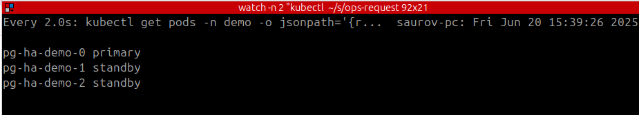
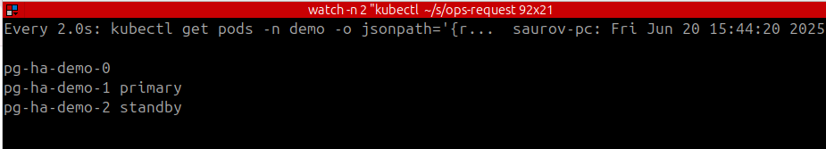
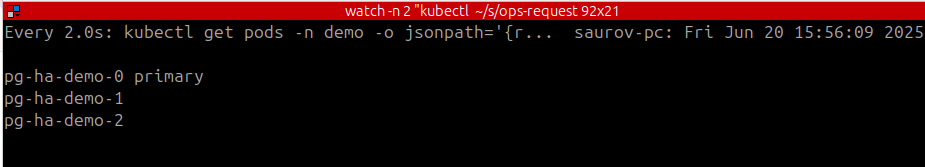
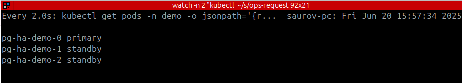
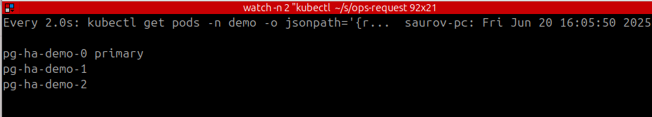
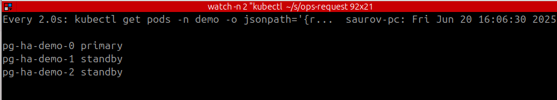
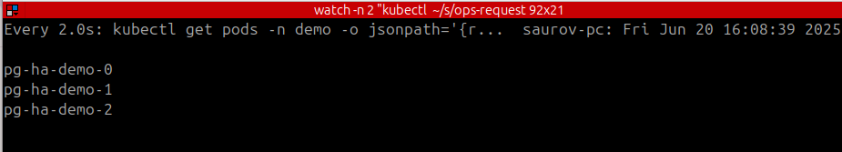

> New to KubeDB? Please start [here](/docs/README.md).

# Ensuring Rock-Solid PostgreSQL Uptime

## A Guide to KubeDB's High Availability and Auto-Failover

In today's data-driven world, database downtime is not just an inconvenience; it can be a critical business failure. For teams running stateful applications on Kubernetes, ensuring the resilience of their databases is paramount. This is where KubeDB steps in, offering a robust, cloud-native way to manage PostgreSQL on Kubernetes.

One of KubeDB's most powerful features is its built-in support for High
Availability (HA) and automated failover. The KubeDB operator continuously 
monitors the health of your PostgreSQL cluster and along with the db sidecar injected 
for maintaining failover, it can automatically 
respond to failures, ensuring your database remains available with 
minimal disruption.

This article will guide you through KubeDB's automated failover capabilities for PostgreSQL. We will set up an HA cluster and then simulate a leader failure to see KubeDB's auto-recovery mechanism in action.

> You will see how fast the failover happens when it's truly necessary. Failover in KubeDB-managed PostgreSQL will generally happen within 2–10 seconds depending on your cluster networking. There is an exception scenario that we discussed later in this doc where failover might take a bit longer up to 45 seconds. But that is a bit rare though.

### Before You Start

To follow along with this tutorial, you will need:

1. A running Kubernetes cluster.
2. KubeDB [installed](https://kubedb.com/docs/v2025.5.30/setup/install/kubedb/) in your cluster.
3. kubectl command-line tool configured to communicate with your cluster.


### Step 1: Create a High-Availability PostgreSQL Cluster

First, we need to deploy a PostgreSQL cluster configured for High Availability.
Unlike a Standalone instance, a HA cluster consists of a primary pod
and one or more standby pods that are ready to take over if the leader
fails.

Save the following YAML as pg-ha-demo.yaml. This manifest 
defines a 3-node PostgreSQL cluster with streaming replication enabled.

```yaml
apiVersion: kubedb.com/v1
kind: Postgres
metadata:
  name: pg-ha-demo
  namespace: demo
spec:
  replicas: 3
  storageType: Durable
  podTemplate:
    spec:
      containers:
      - name: postgres
        resources:
          requests:
            cpu: "200m"
            memory: "256Mi"
  storage:
    accessModes:
    - ReadWriteOnce
    resources:
      requests:
        storage: 7Gi
  version: "17.2"
```

Now, create the namespace and apply the manifest:

```shell
# Create the namespace if it doesn't exist
kubectl create ns demo

# Apply the manifest to deploy the cluster
kubectl apply -f pg-ha-demo.yaml
```

You can monitor the status until all pods are ready:
```shell
watch kubectl get pg,petset,pods -n demo
```
See the database is ready.

```shell
➤ kubectl get pg,petset,pods -n demo
NAME                             VERSION   STATUS   AGE
postgres.kubedb.com/pg-ha-demo   17.2      Ready    4m45s

NAME                                      AGE
petset.apps.k8s.appscode.com/pg-ha-demo   4m41s

NAME               READY   STATUS    RESTARTS   AGE
pod/pg-ha-demo-0   2/2     Running   0          4m41s
pod/pg-ha-demo-1   2/2     Running   0          2m45s
pod/pg-ha-demo-2   2/2     Running   0          2m39s
```

Inspect who is primary and who is standby.

```shell
# you can inspect who is primary
# and who is secondary like below

➤ kubectl get pods -n demo --show-labels | grep role
pg-ha-demo-0   2/2     Running   0          20m   app.kubernetes.io/component=database,app.kubernetes.io/instance=pg-ha-demo,app.kubernetes.io/managed-by=kubedb.com,app.kubernetes.io/name=postgreses.kubedb.com,apps.kubernetes.io/pod-index=0,controller-revision-hash=pg-ha-demo-6c5954fd77,kubedb.com/role=primary,statefulset.kubernetes.io/pod-name=pg-ha-demo-0
pg-ha-demo-1   2/2     Running   0          19m   app.kubernetes.io/component=database,app.kubernetes.io/instance=pg-ha-demo,app.kubernetes.io/managed-by=kubedb.com,app.kubernetes.io/name=postgreses.kubedb.com,apps.kubernetes.io/pod-index=1,controller-revision-hash=pg-ha-demo-6c5954fd77,kubedb.com/role=standby,statefulset.kubernetes.io/pod-name=pg-ha-demo-1
pg-ha-demo-2   2/2     Running   0          18m   app.kubernetes.io/component=database,app.kubernetes.io/instance=pg-ha-demo,app.kubernetes.io/managed-by=kubedb.com,app.kubernetes.io/name=postgreses.kubedb.com,apps.kubernetes.io/pod-index=2,controller-revision-hash=pg-ha-demo-6c5954fd77,kubedb.com/role=standby,statefulset.kubernetes.io/pod-name=pg-ha-demo-2

```
The pod having `kubedb.com/role=primary` is the primary and `kubedb.com/role=standby` are the standby's.


Lets create a table in the primary.

```shell
# find the primary pod
➤ kubectl get pods -n demo --show-labels | grep primary | awk '{ print $1 }'
pg-ha-demo-0

# exec into the primary pod
➤ kubectl exec -it -n demo pg-ha-demo-0  -- bash
Defaulted container "postgres" out of: postgres, pg-coordinator, postgres-init-container (init)
pg-ha-demo-0:/$ psql
psql (17.2)
Type "help" for help.

postgres=# create table hello(id int);
CREATE TABLE

```

Verify the table creation in standby's.

```shell
➤ kubectl exec -it -n demo pg-ha-demo-1  -- bash
Defaulted container "postgres" out of: postgres, pg-coordinator, postgres-init-container (init)
pg-ha-demo-1:/$ psql
psql (17.2)
Type "help" for help.

postgres=# \dt
               List of relations
 Schema |        Name        | Type  |  Owner   
--------+--------------------+-------+----------
 public | hello              | table | postgres # this was created in primary earlier, so replication working
 public | kubedb_write_check | table | postgres
(2 rows)


```
### Step 2: Simulating a Failover

Before simulating failover, let's discuss how we handle these failover scenarios in KubeDB-managed Postgresql. 
We use sidecar container with all db pods, and inside that sidecar container, we use [raft](https://raft.github.io/)
protocol to detect the viable primary of the postgresql cluster. Raft will choose a db pod as a leader of the postgresql cluster, we will 
check if that pod can really run as a leader. If everything is good with that chosen pod, we will run it as primary. This whole process of failover 
generally takes less than 10 seconds to complete. So you can expect very rapid failover to ensure high availability of your postgresql cluster.


Now current running primary is `pg-ha-demo-0`. Let's open another terminal and run the command below.


```shell
watch -n 2 "kubectl get pods -n demo -o jsonpath='{range .items[*]}{.metadata.name} {.metadata.labels.kubedb\\.com/role}{\"\\n\"}{end}'"

```
It will show current pg cluster roles.



#### Case 1: Delete the current primary

Lets delete the current primary and see how the role change happens almost immediately.

```shell
➤ kubectl delete pods -n demo pg-ha-demo-0 
pod "pg-ha-demo-0" deleted

```



You see almost immediately the failover happened. Here's what happened internally:

- Distributed raft algorithm implementation is running 24 * 7 in your each db sidecar. You can configure this behavior as shown below.
- As soon as `pg-ha-demo-0` was being deleted and raft inside `pg-ha-demo-0` senses the termination, it immediately switches the leadership to any other viable leader before termination.
- In our case, raft inside `pg-ha-demo-1` got the leadership.
- Now this leader switch only means raft leader switch, not the **database leader switch(aka failover)** yet. So `pg-ha-demo-1` still running as replica. It will be primary after the next step.
- Once raft sidecar inside `pg-ha-demo-1` see it has become leader of the cluster, it initiates the database failover process and start running as primary. 
- So, now `pg-ha-demo-1` is running as primary.

```yaml
# You can find this part in your db yaml by running
# kubectl get pg -n demo pg-ha-demo -oyaml
# under db.spec section
# vist below link for more information
# https://github.com/kubedb/apimachinery/blob/97c18a62d4e33a112e5f887dc3ad910edf3f3c82/apis/kubedb/v1/postgres_types.go#L204

leaderElection:
  electionTick: 10
  heartbeatTick: 1
  maximumLagBeforeFailover: 67108864
  period: 300ms
  transferLeadershipInterval: 1s
  transferLeadershipTimeout: 1m0s
  
```

Now we know how failover is done, let's check if the new primary is working.

```shell
➤ kubectl exec -it -n demo pg-ha-demo-1  -- bash
Defaulted container "postgres" out of: postgres, pg-coordinator, postgres-init-container (init)
pg-ha-demo-1:/$ psql
psql (17.2)
Type "help" for help.

postgres=# create table hi(id int);
CREATE TABLE # See we were able to create the database. so failover was successful.
postgres=# 

```


You will see the deleted pod (pg-ha-demo-0) is brought back by the kubedb operator and it is now assigned to standby role.


Lets check if the standby(`pg-ha-demo-0`) got the updated data from new primary `pg-ha-demo-1`.

```shell
➤ kubectl exec -it -n demo pg-ha-demo-0  -- bash
Defaulted container "postgres" out of: postgres, pg-coordinator, postgres-init-container (init)
pg-ha-demo-0:/$ psql
psql (17.2)
Type "help" for help.

postgres=# \dt
               List of relations
 Schema |        Name        | Type  |  Owner   
--------+--------------------+-------+----------
 public | hello              | table | postgres
 public | hi                 | table | postgres # this was created in the new primary
 public | kubedb_write_check | table | postgres
(3 rows)

```

#### Case 2: Delete the current primary and One replica

```shell
➤ kubectl delete pods -n demo pg-ha-demo-1 pg-ha-demo-2
pod "pg-ha-demo-1" deleted
pod "pg-ha-demo-2" deleted
```
Again we can see the failover happened pretty quickly.



After 10-30 second, the deleted pods will be back and will have its role.



Lets validate the cluster state from new primary(`pg-ha-demo-0`).

```shell
➤ kubectl exec -it -n demo pg-ha-demo-0  -- bash
Defaulted container "postgres" out of: postgres, pg-coordinator, postgres-init-container (init)
pg-ha-demo-0:/$ psql
psql (17.2)
Type "help" for help.

postgres=# select * from pg_stat_replication;
 pid  | usesysid | usename  | application_name | client_addr | client_hostname | client_port |         backend_start         | backend_xmin |   state   | sent_lsn  | write_lsn | flush_lsn | replay_lsn |    write_lag    |    flush_lag    |   replay_lag    | sync_priority | sync_state |          reply_time           
------+----------+----------+------------------+-------------+-----------------+-------------+-------------------------------+--------------+-----------+-----------+-----------+-----------+------------+-----------------+-----------------+-----------------+---------------+------------+-------------------------------
 1098 |       10 | postgres | pg-ha-demo-1     | 10.42.0.191 |                 |       49410 | 2025-06-20 09:56:36.989448+00 |              | streaming | 0/70016A8 | 0/70016A8 | 0/70016A8 | 0/70016A8  | 00:00:00.000142 | 00:00:00.00066  | 00:00:00.000703 |             0 | async      | 2025-06-20 09:59:40.217223+00
 1129 |       10 | postgres | pg-ha-demo-2     | 10.42.0.192 |                 |       35216 | 2025-06-20 09:56:39.042789+00 |              | streaming | 0/70016A8 | 0/70016A8 | 0/70016A8 | 0/70016A8  | 00:00:00.000219 | 00:00:00.000745 | 00:00:00.00079  |             0 | async      | 2025-06-20 09:59:40.217308+00
(2 rows)

```

#### Case3: Delete any of the replica's

Let's delete both of the standby's.

```shell
kubectl delete pods -n demo pg-ha-demo-1 pg-ha-demo-2
pod "pg-ha-demo-1" deleted
pod "pg-ha-demo-2" deleted

```



Shortly both of the pods will be back with its role.



Lets verify cluster state.
```shell
➤ kubectl exec -it -n demo pg-ha-demo-0  -- bash
Defaulted container "postgres" out of: postgres, pg-coordinator, postgres-init-container (init)
pg-ha-demo-0:/$ psql
psql (17.2)
Type "help" for help.

postgres=# select * from pg_stat_replication;
 pid  | usesysid | usename  | application_name | client_addr | client_hostname | client_port |         backend_start         | backend_xmin |   state   | sent_lsn  | write_lsn | flush_lsn | replay_lsn |    write_lag    |    flush_lag    |   replay_lag    | sync_priority | sync_state |          reply_time           
------+----------+----------+------------------+-------------+-----------------+-------------+-------------------------------+--------------+-----------+-----------+-----------+-----------+------------+-----------------+-----------------+-----------------+---------------+------------+-------------------------------
 5564 |       10 | postgres | pg-ha-demo-2     | 10.42.0.194 |                 |       51560 | 2025-06-20 10:06:26.988807+00 |              | streaming | 0/7014A58 | 0/7014A58 | 0/7014A58 | 0/7014A58  | 00:00:00.000178 | 00:00:00.000811 | 00:00:00.000848 |             0 | async      | 2025-06-20 10:07:50.218299+00
 5572 |       10 | postgres | pg-ha-demo-1     | 10.42.0.193 |                 |       36158 | 2025-06-20 10:06:27.980841+00 |              | streaming | 0/7014A58 | 0/7014A58 | 0/7014A58 | 0/7014A58  | 00:00:00.000194 | 00:00:00.000818 | 00:00:00.000895 |             0 | async      | 2025-06-20 10:07:50.218337+00
(2 rows)


```

#### Case 4: Delete both primary and all replicas

Let's delete all the pods.

```shell
➤ kubectl delete pods -n demo pg-ha-demo-0 pg-ha-demo-1 pg-ha-demo-2
pod "pg-ha-demo-0" deleted
pod "pg-ha-demo-1" deleted
pod "pg-ha-demo-2" deleted

```


Within 20-30 second, all of the pod should be back.


Lets verify the cluster state now.

```shell
➤ kubectl exec -it -n demo pg-ha-demo-0  -- bash
Defaulted container "postgres" out of: postgres, pg-coordinator, postgres-init-container (init)
pg-ha-demo-0:/$ psql
psql (17.2)
Type "help" for help.

postgres=# select * from pg_stat_replication;
 pid | usesysid | usename  | application_name | client_addr | client_hostname | client_port |         backend_start         | backend_xmin |   state   | sent_lsn  | write_lsn | flush_lsn | replay_lsn |    write_lag    |    flush_lag    |   replay_lag    | sync_priority | sync_state |          reply_time           
-----+----------+----------+------------------+-------------+-----------------+-------------+-------------------------------+--------------+-----------+-----------+-----------+-----------+------------+-----------------+-----------------+-----------------+---------------+------------+-------------------------------
 132 |       10 | postgres | pg-ha-demo-2     | 10.42.0.197 |                 |       34244 | 2025-06-20 10:09:20.27726+00  |              | streaming | 0/9001848 | 0/9001848 | 0/9001848 | 0/9001848  | 00:00:00.00021  | 00:00:00.000841 | 00:00:00.000894 |             0 | async      | 2025-06-20 10:11:02.527633+00
 133 |       10 | postgres | pg-ha-demo-1     | 10.42.0.196 |                 |       40102 | 2025-06-20 10:09:20.279987+00 |              | streaming | 0/9001848 | 0/9001848 | 0/9001848 | 0/9001848  | 00:00:00.000225 | 00:00:00.000848 | 00:00:00.000905 |             0 | async      | 2025-06-20 10:11:02.527653+00
(2 rows)


```

> **We make sure the pod with highest lsn (you can think lsn as the highest data point available in your cluster) always run as primary, so if a case occur where the pod with highest lsn is being terminated, we will not perform the failover until the highest lsn pod is back online. So in a case, where that highest lsn primary is not recoverable, read [this](https://appscode.com/blog/post/kubedb-v2025.2.19/#forcefailover) to do a force failover.**


## A Guide to Postgres Backup And Restore

You can configure Backup and Restore following the below documentation.

[Backup and Restore](/docs/guides/postgres/backup)

Youtube video Links: [link](https://www.youtube.com/watch?v=j9y5MsB-guQ)


## A Guide to Postgres PITR
Documentaion Link: [PITR](/docs/guides/postgres/pitr)

Concepts and Demo: [link](https://www.youtube.com/watch?v=gR5UdN6Y99c)

Basic Demo: [link](https://www.youtube.com/watch?v=BdMSVjNQtCA)

Full Demo: [link](https://www.youtube.com/watch?v=KAl3rdd8i6k)


## CleanUp

```shell
kubectl delete pg -n demo pg-ha-demo
```


## Next Steps

- Learn about [backup and restore](/docs/guides/postgres/backup/stash/overview/index.md) PostgreSQL database using Stash.
- Learn about initializing [PostgreSQL with Script](/docs/guides/postgres/initialization/script_source.md).
- Learn about [custom PostgresVersions](/docs/guides/postgres/custom-versions/setup.md).
- Want to setup PostgreSQL cluster? Check how to [configure Highly Available PostgreSQL Cluster](/docs/guides/postgres/clustering/ha_cluster.md)
- Monitor your PostgreSQL database with KubeDB using [built-in Prometheus](/docs/guides/postgres/monitoring/using-builtin-prometheus.md).
- Monitor your PostgreSQL database with KubeDB using [Prometheus operator](/docs/guides/postgres/monitoring/using-prometheus-operator.md).
- Detail concepts of [Postgres object](/docs/guides/postgres/concepts/postgres.md).
- Use [private Docker registry](/docs/guides/postgres/private-registry/using-private-registry.md) to deploy PostgreSQL with KubeDB.
- Want to hack on KubeDB? Check our [contribution guidelines](/docs/CONTRIBUTING.md).