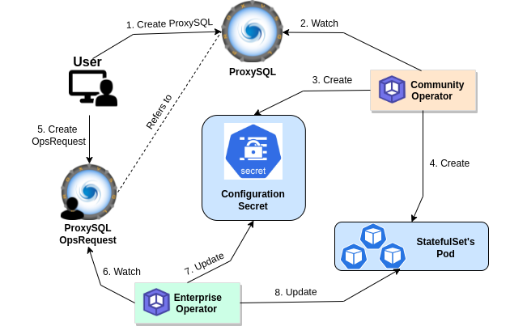

> New to KubeDB? Please start [here](/docs/README.md).

# ProxySQL Declarative Configuration

## What is ProxySQL Declarative Configuration

To bootstrap a native ProxySQL server with desired configuration we need to pass a configuration file named `proxysql.cnf`. Through the proxysql.cnf file we can pass some initial configuration for various tables and global variables with a specific format. You can check the link for a sample proxysql.cnf and its grammar [here](https://github.com/sysown/proxysql/blob/v2.x/etc/proxysql.cnf).

With kubedb proxysql we have eased this process with declarative yaml. We have scoped the CRD in a specific way so that you can provide the desired configuration in a yaml format. 

## How it works 

User will provide the configuration under the `.spec.initConfig` section of the proxysql yaml. The operator parses the yaml and creates a configuration file. A secret is then created, holding that configuration file inside. Each time a new pod is created it is created with the configuration file inside that secret.

<figure align="center">
  
<figcaption align="center">Fig: ProxySQL Configuration Secret Lifecycle</figcaption>
</figure>

At any time the user might need to change the configuration. To serve that purpose we have introduced ProxySQLOpsRequest. When an ops-request is being created the enterprise operator updates the configuration secret and applies the changes to the proxysql cluster nodes. This is how the the configuration secret remains as a source of truth for the ProxySQL CRO and any changes are made in a declarative way. 

> User can exec into any proxysql pod and change any configuration from the admin panel anytime. But that won't update the configuration secret. We recommend the ops-request to keep things declarative and keep the proxysql.cnf file always updated. 

## API Description

You can write the configuration in yaml format under the `spec.initConfig` section and the operator would do the rest. `spec.initConfig` section is devided into four sections : `spec.initConfig.mysqlUsers` , `spec.initConfig.mysqlQueryRules`, `spec.initConfig.mysqlVariables`, `spec.initConfig.adminVariables`. You can configure the `mysql_users` and `mysql_query_rules` tables and also the global variables under the corresponding fields. This is the [api](https://pkg.go.dev/kubedb.dev/apimachinery@v0.29.1/apis/kubedb/v1alpha2#ProxySQLConfiguration) documentation. We will discuss in detail about each of the fields. 

### initConfig.mysqlUsers

This is an array field. Each of the array element should carry infos of users that you want to be present in the `mysql_users` table inside the proxysql server. 

As per the official proxysql documentation, `mysql_users` table looks something like [this](https://proxysql.com/documentation/main-runtime/#mysql_users). So with kubedb we have created [this](https://pkg.go.dev/kubedb.dev/apimachinery@v0.29.1/apis/kubedb/v1alpha2#MySQLUser) api to configure the table. Which basically means that you can configure everything through the yaml except the password. The password will be automatically fetched from the backend server. So you don't need to mention this. This has been done keeping in mind the data sensitivity issue with yaml. 

```yaml
spec:
  ...
  initConfig:
    mysqlUsers:
    - username: wolverine
      active: 1
      default_hostgroup: 2 
      default_schema: marvel
    - username: superman
      active: 1 
      default_hostgroup: 3
    ...
```

### initConfig.mysqlQueryRules

This is an array field. Each of the array element should carry infos of query rules that you want to set up for the proxysql server. With all these query rules you mention, operator will set up the `mysql_query_rules` table. 

As per the official proxysql documentation, `mysql_query_rules` table looks something like [this](https://proxysql.com/documentation/main-runtime/#mysql_query_rules). With kubedb we are using an array of [runtime.rawExtension](https://pkg.go.dev/k8s.io/apimachinery/pkg/runtime#RawExtension) for the `mysqlQueryRules`. You can configure all the column for a rule through this. In simple terms, just use this as a key-value yaml section. 

```yaml
spec:
    ...
    initConfig:
        ...
        mysqlQueryRules:
            - rule_id: 1
              active: 1
              match_pattern: "^SELECT .* FOR UPDATE$"
              destination_hostgroup: 2
              apply: 1
            - rule_id: 2
              active: 1
              match_pattern: "^SELECT"
              destination_hostgroup: 3
              apply: 1
        ...
```

### initConfig.mysqlVariables

This is a [runtime.rawExtension](https://pkg.go.dev/k8s.io/apimachinery/pkg/runtime#RawExtension) field. You can pass all the [MySQL Variables](https://proxysql.com/Documentation/global-variables/mysql-variables/) you want to configure in a key-value format under this section. You can configure almost all the mysql variables except `interfaces`, `monitor_username`, `monitor_password`, `ssl_p2s_cert`, `ssl_p2s_key`, `ssl_p2s_ca`. We have protected the `interface` variable because a lot of our operator logic depends on it.  

```yaml
spec:
    ...
    initConfig:
        ...
        mysqlVariables:
            max_connections: 1024
            default_schema: "information_schema"    
            stacksize: 1048576
            default_schema: "information_schema"
            commands_stats: "true"
            sessions_sort: "true"
            server_version: "8.0.27"
            monitor_history: 60000
            ping_timeout_server: 200
            default_query_timeout: 36000000
            connect_timeout_server: 10000
            monitor_ping_interval: 200000
            poll_timeout: 2000
            max_connections: 2048
            default_query_delay: 0
            ping_interval_server_msec: 10000
            have_compress: "true"
            threads: 4
            monitor_connect_interval: 200000
        ...
```
### initConfig.adminVariables

This is a [runtime.rawExtension](https://pkg.go.dev/k8s.io/apimachinery/pkg/runtime#RawExtension) field. You can pass all the [Admin Variables](https://proxysql.com/Documentation/global-variables/admin-variables/) you want to configure in a key-value format under this section. You can configure almost all the admin variables except `admin_credentials` and `mysql_interface` . The default `admin_credential` is always `admin:admin`. If you pass any credential from the `spec.authSecret` our operator would add this too. And if you don't do so, the operator will create one and add that as the `cluster_admin`. And as for the `mysql_interface`, we have protected this because our operator code logic depends on this in some case. 

```yaml
spec:
    ...
    initConfig:
        ...
        adminVariables:
            cluster_mysql_users_save_to_disk: "true"
            cluster_mysql_servers_save_to_disk: "true"
            cluster_proxysql_servers_diffs_before_sync: "3"
            restapi_enabled: "true"
            cluster_mysql_query_rules_diffs_before_sync: "3"
            cluster_mysql_servers_diffs_before_sync: "3"
            cluster_proxysql_servers_save_to_disk: "true"
            restapi_port: "6070"
            cluster_mysql_query_rules_save_to_disk: "true"
            cluster_check_status_frequency: "100"
            cluster_mysql_users_diffs_before_sync: "3"
            refresh_interval: "2000"
            cluster_check_interval_ms: "200"
        ...
```

### Complete YAML

```yaml
apiVersion: kubedb.com/v1alpha2
kind: ProxySQL
metadata:
  name: proxy-server
  namespace: demo
spec:
  version: "2.3.2-debian"  
  replicas: 3
  mode: GroupReplication
  backend:
    name: mysql-server
  initConfig:
    mysqlUsers:
    - username: wolverine
      active: 1
      default_hostgroup: 2 
      default_schema: marvel
    - username: superman
      active: 1 
      default_hostgroup: 3
    mysqlQueryRules:
    - rule_id: 1
      active: 1
      match_pattern: "^SELECT .* FOR UPDATE$"
      destination_hostgroup: 2
      apply: 1
    - rule_id: 2
      active: 1
      match_pattern: "^SELECT"
      destination_hostgroup: 3
      apply: 1
    mysqlVariables:
      stacksize: 1048576
      default_schema: "information_schema"
      commands_stats: "true"
      sessions_sort: "true"
      server_version: "8.0.27"
      monitor_history: 60000
      ping_timeout_server: 200
      default_query_timeout: 36000000
      connect_timeout_server: 10000
      monitor_ping_interval: 200000
      poll_timeout: 2000
      max_connections: 2048
      default_query_delay: 0
      ping_interval_server_msec: 10000
      have_compress: "true"
      threads: 4
      monitor_connect_interval: 200000
    adminVariables:
      cluster_mysql_users_save_to_disk: "true"
      cluster_mysql_servers_save_to_disk: "true"
      cluster_proxysql_servers_diffs_before_sync: "3"
      restapi_enabled: "true"
      cluster_mysql_query_rules_diffs_before_sync: "3"
      cluster_mysql_servers_diffs_before_sync: "3"
      cluster_proxysql_servers_save_to_disk: "true"
      restapi_port: "6070"
      cluster_mysql_query_rules_save_to_disk: "true"
      cluster_check_status_frequency: "100"
      cluster_mysql_users_diffs_before_sync: "3"
      refresh_interval: "2000"
      cluster_check_interval_ms: "200"
  terminationPolicy: WipeOut
  ```