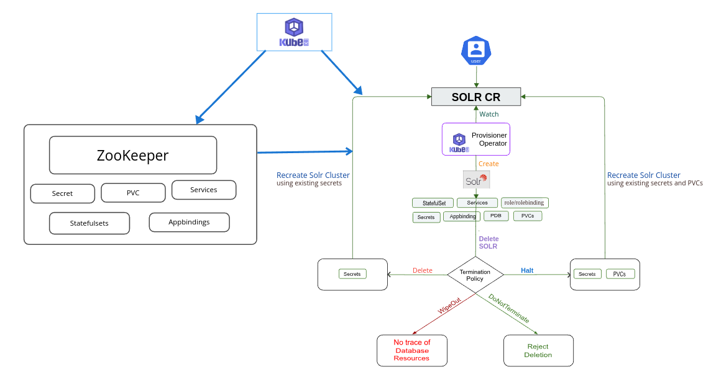

> New to KubeDB? Please start [here](/docs/README.md).

# Solr QuickStart

This tutorial will show you how to use KubeDB to run an Solr database.

<p align="center">
  
</p>

## Before You Begin

At first, you need to have a Kubernetes cluster, and the `kubectl` command-line tool must be configured to communicate with your cluster. If you do not already have a cluster, you can create one by using [kind](https://kind.sigs.k8s.io/docs/user/quick-start/).

Now, install the KubeDB operator in your cluster following the steps [here](/docs/setup/install/_index.md).

To keep things isolated, this tutorial uses a separate namespace called `demo` throughout this tutorial.

```bash
$ kubectl create namespace demo
namespace/demo created

$ kubectl get namespace
NAME                 STATUS   AGE
demo                 Active   9s
```

> Note: YAML files used in this tutorial are stored in [guides/solr/quickstart/overview/yamls](https://github.com/kubedb/docs/tree//docs/guides/solr/quickstart/overview/yamls) folder in GitHub repository [kubedb/docs](https://github.com/kubedb/docs).

> We have designed this tutorial to demonstrate a production setup of KubeDB managed Solr. If you just want to try out KubeDB, you can bypass some safety features following the tips [here](/docs/guides/solr/quickstart/overview/index.md#tips-for-testing).

## Find Available StorageClass

We will have to provide `StorageClass` in Solr CRD specification. Check available `StorageClass` in your cluster using the following command,

```bash
$ kubectl get storageclass
NAME                 PROVISIONER             RECLAIMPOLICY   VOLUMEBINDINGMODE      ALLOWVOLUMEEXPANSION   AGE
standard (default)   rancher.io/local-path   Delete          WaitForFirstConsumer   false                  14h
```

Here, we have `standard` StorageClass in our cluster from [Local Path Provisioner](https://github.com/rancher/local-path-provisioner).

## Find Available SolrVersion

When you install the KubeDB operator, it registers a CRD named Solrversions. The installation process comes with a set of tested SolrVersion objects. Let's check available SolrVersions by,

```bash
$ kubectl get solrversion
NAME     VERSION   DB_IMAGE                              DEPRECATED   AGE
8.11.2   8.11.2    ghcr.io/appscode-images/solr:8.11.2                9d
9.4.1    9.4.1     ghcr.io/appscode-images/solr:9.4.1                 9d
```

Notice the `DEPRECATED` column. Here, `true` means that this SolrVersion is deprecated for the current KubeDB version. KubeDB will not work for deprecated SolrVersion.

In this tutorial, we will use `9.4.1` SolrVersion CR to create an Solr cluster.

> Note: An image with a higher modification tag will have more features and fixes than an image with a lower modification tag. Hence, it is recommended to use ZooKeeperVersion CRD with the highest modification tag to take advantage of the latest features. For example, use `xpack-8.11.1` over `7.9.1-xpack`.

## Create an Solr Cluster

The KubeDB operator implements a Solr CRD to define the specification of a Solr database.

The Kubedb Solr runs in solrcloud mode. Hence, it needs a external zookeeper to distribute replicas among pods and save configurations.

We will use KubeDB ZooKeeper for this purpose.

The ZooKeeper instance used for this tutorial:

```yaml
apiVersion: kubedb.com/v1alpha2
kind: ZooKeeper
metadata:
  name: zoo-com
  namespace: demo
spec:
  version: 3.8.3
  replicas: 3
  terminationPolicy: Halt
  adminServerPort: 8080
  storage:
    resources:
      requests:
        storage: "100Mi"
    storageClassName: standard
    accessModes:
      - ReadWriteOnce
```

We have to apply zookeeper first and wait till atleast pods are running to make sure that a cluster has been formed.

Here,

- `spec.version` - is the name of the ZooKeeperVersion CR. Here, an ZooKeeper of version `3.8.3` will be created.
- `spec.replicas` - specifies the number of ZooKeeper nodes.
- `spec.storageType` - specifies the type of storage that will be used for ZooKeeper database. It can be `Durable` or `Ephemeral`. The default value of this field is `Durable`. If `Ephemeral` is used then KubeDB will create the ZooKeeper database using `EmptyDir` volume. In this case, you don't have to specify `spec.storage` field. This is useful for testing purposes.
- `spec.storage` specifies the StorageClass of PVC dynamically allocated to store data for this database. This storage spec will be passed to the StatefulSet created by the KubeDB operator to run database pods. You can specify any StorageClass available in your cluster with appropriate resource requests. If you don't specify `spec.storageType: Ephemeral`, then this field is required.
- `spec.terminationPolicy` specifies what KubeDB should do when a user try to delete ZooKeeper CR. Termination policy `Delete` will delete the database pods, secret and PVC when the ZooKeeper CR is deleted.

> Note: `spec.storage` section is used to create PVC for database pod. It will create PVC with storage size specified in the `storage.resources.requests` field. Don't specify `limits` here. PVC does not get resized automatically.

Let's create the ZooKeeper CR that is shown above:

```bash
$ $ kubectl apply -f https://github.com/kubedb/docs/raw//docs/guides/solr/quickstart/overview/yamls/zookeeper/zookeeper.yaml
ZooKeeper.kubedb.com/es-quickstart created
```

The ZooKeeper's `STATUS` will go from `Provisioning` to `Ready` state within few minutes. Once the `STATUS` is `Ready`, you are ready to use the database.

```bash
$ kubectl get ZooKeeper -n demo -w
NAME   TYPE                  VERSION   STATUS   AGE
zoo-com    kubedb.com/v1alpha2   3.7.2     Ready    13m
```

Then we can deploy solr in our cluster.

The Solr instance used for this tutorial:

```yaml
apiVersion: kubedb.com/v1alpha2
kind: Solr
metadata:
  name: solr-combined
  namespace: demo
spec:
  version: 9.4.1
  terminationPolicy: Halt
  replicas: 2
  zookeeperRef:
    name: zk-com
    namespace: demo
  storage:
    accessModes:
      - ReadWriteOnce
    resources:
      requests:
        storage: 2Gi
    storageClassName: standard
```

Here,

- `spec.version` - is the name of the SolrVersion CR. Here, an Solr of version `3.8.3` will be created.
- `spec.replicas` - specifies the number of Solr nodes.
- `spec.storageType` - specifies the type of storage that will be used for Solr database. It can be `Durable` or `Ephemeral`. The default value of this field is `Durable`. If `Ephemeral` is used then KubeDB will create the Solr database using `EmptyDir` volume. In this case, you don't have to specify `spec.storage` field. This is useful for testing purposes.
- `spec.storage` specifies the StorageClass of PVC dynamically allocated to store data for this database. This storage spec will be passed to the StatefulSet created by the KubeDB operator to run database pods. You can specify any StorageClass available in your cluster with appropriate resource requests. If you don't specify `spec.storageType: Ephemeral`, then this field is required.
- `spec.terminationPolicy` specifies what KubeDB should do when a user try to delete Solr CR. Termination policy `Delete` will delete the database pods, secret and PVC when the Solr CR is deleted.

> Note: `spec.storage` section is used to create PVC for database pod. It will create PVC with storage size specified in the `storage.resources.requests` field. Don't specify `limits` here. PVC does not get resized automatically.

Let's create the Solr CR that is shown above:

```bash
$ kubectl apply -f https://github.com/kubedb/docs/raw//docs/guides/solr/quickstart/overview/yamls/solr/solr.yaml
solr.kubedb.com/solr-combined created
```

The Solr's `STATUS` will go from `Provisioning` to `Ready` state within few minutes. Once the `STATUS` is `Ready`, you are ready to use the database.

```bash
$ kubectl get Solr -n demo -w
NAME            TYPE                    VERSION     STATUS   AGE
solr-combined   kubedb.com/v1alpha2     9.4.1       Ready    17m
```


Describe the Solr object to observe the progress if something goes wrong or the status is not changing for a long period of time:

```bash
$ Name:       solr-combined
Namespace:    demo
Labels:       <none>
Annotations:  <none>
API Version:  kubedb.com/v1alpha2
Kind:         Solr
Metadata:
  Creation Timestamp:  2024-05-03T10:44:35Z
  Finalizers:
    kubedb.com
  Generation:        1
  Resource Version:  778471
  UID:               8c36f5ce-0f93-4c8d-874d-662b9c404126
Spec:
  Auth Config Secret:
    Name:  solr-combined-auth-config
  Auth Secret:
    Name:  solr-combined-admin-cred
  Health Checker:
    Failure Threshold:  3
    Period Seconds:     20
    Timeout Seconds:    10
  Pod Placement Policy:
    Name:  default
  Pod Template:
    Controller:
    Metadata:
    Spec:
      Containers:
        Name:  solr
        Resources:
          Limits:
            Memory:  2Gi
          Requests:
            Cpu:     900m
            Memory:  2Gi
        Security Context:
          Allow Privilege Escalation:  false
          Capabilities:
            Drop:
              ALL
          Run As Non Root:  true
          Run As User:      8983
          Seccomp Profile:
            Type:  RuntimeDefault
      Init Containers:
        Name:  init-solr
        Resources:
          Limits:
            Memory:  512Mi
          Requests:
            Cpu:     200m
            Memory:  512Mi
        Security Context:
          Allow Privilege Escalation:  false
          Capabilities:
            Drop:
              ALL
          Run As Non Root:  true
          Run As User:      8983
          Seccomp Profile:
            Type:  RuntimeDefault
      Security Context:
        Fs Group:  8983
  Replicas:        3
  Storage:
    Access Modes:
      ReadWriteOnce
    Resources:
      Requests:
        Storage:         1Gi
    Storage Class Name:  standard
  Storage Type:          Durable
  Termination Policy:    Delete
  Version:               9.4.1
  Zookeeper Digest Readonly Secret:
    Name:  solr-combined-zk-digest-readonly
  Zookeeper Digest Secret:
    Name:  solr-combined-zk-digest
  Zookeeper Ref:
    Name:       zoo-com
    Namespace:  demo
Status:
  Conditions:
    Last Transition Time:  2024-05-03T10:44:35Z
    Message:               The KubeDB operator has started the provisioning of Solr: demo/solr-combined
    Observed Generation:   1
    Reason:                DatabaseProvisioningStartedSuccessfully
    Status:                True
    Type:                  ProvisioningStarted
    Last Transition Time:  2024-05-03T10:45:01Z
    Message:               All desired replicas are ready.
    Observed Generation:   1
    Reason:                AllReplicasReady
    Status:                True
    Type:                  ReplicaReady
    Last Transition Time:  2024-05-03T10:45:26Z
    Message:               The Solr: demo/solr-combined is accepting connection
    Observed Generation:   1
    Reason:                DatabaseAcceptingConnectionRequest
    Status:                True
    Type:                  AcceptingConnection
    Last Transition Time:  2024-05-03T10:45:28Z
    Message:               The Solr: demo/solr-combined is accepting write request.
    Observed Generation:   1
    Reason:                DatabaseWriteAccessCheckSucceeded
    Status:                True
    Type:                  DatabaseWriteAccess
    Last Transition Time:  2024-05-03T10:45:28Z
    Message:               The Solr: demo/solr-combined is not accepting connection.
    Observed Generation:   1
    Reason:                AllReplicasReady,AcceptingConnection,ReadinessCheckSucceeded,DatabaseWriteAccessCheckSucceeded
    Status:                True
    Type:                  Ready
    Last Transition Time:  2024-05-03T10:45:30Z
    Message:               The Solr: demo/solr-combined is successfully provisioned.
    Observed Generation:   1
    Reason:                DatabaseSuccessfullyProvisioned
    Status:                True
    Type:                  Provisioned
    Last Transition Time:  2024-05-03T10:45:46Z
    Message:               The Solr: demo/solr-combined is accepting read request.
    Observed Generation:   1
    Reason:                DatabaseReadAccessCheckSucceeded
    Status:                True
    Type:                  DatabaseReadAccess
  Phase:                   Ready
Events:                    <none>
```

### KubeDB Operator Generated Resources

On deployment of an Solr CR, the operator creates the following resources:

```bash
$ kubectl get all,secret,pvc -n demo -l 'app.kubernetes.io/instance=solr-combined'
NAME                  READY   STATUS    RESTARTS   AGE
pod/solr-combined-0   1/1     Running   0          3m40s
pod/solr-combined-1   1/1     Running   0          3m33s
pod/solr-combined-2   1/1     Running   0          3m26s

NAME                         TYPE        CLUSTER-IP     EXTERNAL-IP   PORT(S)    AGE
service/solr-combined        ClusterIP   10.96.99.183   <none>        8983/TCP   3m44s
service/solr-combined-pods   ClusterIP   None           <none>        8983/TCP   3m44s

NAME                                               TYPE              VERSION   AGE
appbinding.appcatalog.appscode.com/solr-combined   kubedb.com/solr   9.4.1     3m44s

NAME                                         AGE
petset.apps.k8s.appscode.com/solr-combined   5m18s


NAME                                      TYPE                       DATA   AGE
secret/solr-combined-admin-cred           kubernetes.io/basic-auth   2      9d
secret/solr-combined-auth-config          Opaque                     1      9d
secret/solr-combined-config               Opaque                     1      3m44s
secret/solr-combined-zk-digest            kubernetes.io/basic-auth   2      9d
secret/solr-combined-zk-digest-readonly   kubernetes.io/basic-auth   2      9d

NAME                                                       STATUS   VOLUME                                     CAPACITY   ACCESS MODES   STORAGECLASS   VOLUMEATTRIBUTESCLASS   AGE
persistentvolumeclaim/solr-combined-data-solr-combined-0   Bound    pvc-6dc5573b-b59f-4ad7-beed-7438400ff500   1Gi        RWO            standard       <unset>                 3m40s
persistentvolumeclaim/solr-combined-data-solr-combined-1   Bound    pvc-1649cba5-b5e1-421b-aa73-ab6a4be0d637   1Gi        RWO            standard       <unset>                 3m33s
persistentvolumeclaim/solr-combined-data-solr-combined-2   Bound    pvc-dcb8c9e2-e64b-4a53-8b46-5c30301bb905   1Gi        RWO            standard       <unset>                 3m26s
```

- `PetSet` - a PetSet(Appscode manages customed statefulset) named after the Solr instance. In topology mode, the operator creates 3 PetSets with name `{Solr-Name}-{Sufix}`.
- `Services` -  2 services are generated for each Solr database.
    - `{Solr-Name}` - the client service which is used to connect to the database. It points to the `overseer` nodes.
    - `{Solr-Name}-pods` - the node discovery service which is used by the Solr nodes to communicate each other. It is a headless service.
- `AppBinding` - an [AppBinding](/docs/guides/elasticsearch/concepts/appbinding/index.md) which hold to connect information for the database. It is also named after the solr instance.
- `Secrets` - 3 types of secrets are generated for each Solr database.
    - `{Solr-Name}-admin-cred` - the auth secrets which hold the `username` and `password` for the solr users. The auth secret `solr-combined-admin-cred` holds the `username` and `password` for `admin` user which lets administrative access.
    - `{Solr-Name}-config` - the default configuration secret created by the operator.
    - `{Solr-Name}-auth-config` - the configuration secret of admin user information created by the operator.
    - `{Solr-Name}-zk-digest` - the auth secret which contains the `username` and `password` for zookeeper digest secret which is able to access zookeeper data.
    - `{Solr-Name}-zk-digest-readonly` - the auth secret which contains the `username` and `password` for zookeeper readonly digest secret which is able to read zookeeper data.


## Connect with Solr Database

We will use [port forwarding](https://kubernetes.io/docs/tasks/access-application-cluster/port-forward-access-application-cluster/) to connect with our Solr database. Then we will use `curl` to send `HTTP` requests to check cluster health to verify that our Solr database is working well.

Let's port-forward the port `8983` to local machine:

```bash
$ kubectl port-forward -n demo svc/solr-combined 8983
Forwarding from 127.0.0.1:8983 -> 8983
Forwarding from [::1]:8983 -> 8983
```

Now, our Solr cluster is accessible at `localhost:9200`.

**Connection information:**

- Address: `localhost:8983`
- Username:

  ```bash
  $ kubectl get secret -n demo solr-combined-admin-cred -o jsonpath='{.data.username}' | base64 -d
  admin
    ```

- Password:

  ```bash
  $ kubectl get secret -n demo solr-combined-admin-cred -o jsonpath='{.data.password}' | base64 -d
  Xy3ZjyU)~(9IO8_n
  ```

Now let's check the health of our Solr database.

```bash
$ curl -XGET -k -u 'admin:Xy3ZjyU)~(9IO8_n' "http://localhost:8983/solr/admin/collections?action=CLUSTERSTATUS"
{
  "responseHeader":{
    "status":0,
    "QTime":1
  },
  "cluster":{
    "collections":{
      "kubedb-collection":{
        "pullReplicas":"0",
        "configName":"kubedb-collection.AUTOCREATED",
        "replicationFactor":1,
        "router":{
          "name":"compositeId"
        },
        "nrtReplicas":1,
        "tlogReplicas":"0",
        "shards":{
          "shard1":{
            "range":"80000000-7fffffff",
            "state":"active",
            "replicas":{
              "core_node2":{
                "core":"kubedb-collection_shard1_replica_n1",
                "node_name":"solr-combined-2.solr-combined-pods.demo:8983_solr",
                "type":"NRT",
                "state":"active",
                "leader":"true",
                "force_set_state":"false",
                "base_url":"http://solr-combined-2.solr-combined-pods.demo:8983/solr"
              }
            },
            "health":"GREEN"
          }
        },
        "health":"GREEN",
        "znodeVersion":4
      }
    },
    "live_nodes":["solr-combined-2.solr-combined-pods.demo:8983_solr","solr-combined-1.solr-combined-pods.demo:8983_solr","solr-combined-0.solr-combined-pods.demo:8983_solr"]
  }
}
```

From the health information above, we can see that health of our collections in Solr cluster's status is `green` which means the cluster is healthy.

## Halt Solr

KubeDB takes advantage of `ValidationWebhook` feature in Kubernetes 1.9.0 or later clusters to implement `DoNotTerminate` termination policy. If admission webhook is enabled, it prevents the user from deleting the database as long as the `spec.terminationPolicy` is set `DoNotTerminate`.

To halt the database, we have to set `spec.terminationPolicy:` to `Halt` by updating it,

```bash
$ kubectl edit solr -n demo solr-combined

>> spec:
>>   terminationPolicy: Halt
```

Now, if you delete the Solr object, the KubeDB operator will delete every resource created for this Solr CR, but leaves the auth secrets, and PVCs.

```bash
$  kubectl delete solr -n demo solr-combined
solr.kubedb.com "solr-combined" deleted
```

Check resources:

```bash
$ kubectl get all,petset,secret,pvc -n demo -l 'app.kubernetes.io/instance=solr-combined'
NAME                                      TYPE                       DATA   AGE
secret/solr-combined-admin-cred           kubernetes.io/basic-auth   2      9d
secret/solr-combined-auth-config          Opaque                     1      9d
secret/solr-combined-zk-digest            kubernetes.io/basic-auth   2      9d
secret/solr-combined-zk-digest-readonly   kubernetes.io/basic-auth   2      9d

NAME                                                       STATUS   VOLUME                                     CAPACITY   ACCESS MODES   STORAGECLASS   VOLUMEATTRIBUTESCLASS   AGE
persistentvolumeclaim/solr-combined-data-solr-combined-0   Bound    pvc-6dc5573b-b59f-4ad7-beed-7438400ff500   1Gi        RWO            standard       <unset>                 24m
persistentvolumeclaim/solr-combined-data-solr-combined-1   Bound    pvc-1649cba5-b5e1-421b-aa73-ab6a4be0d637   1Gi        RWO            standard       <unset>                 24m
persistentvolumeclaim/solr-combined-data-solr-combined-2   Bound    pvc-dcb8c9e2-e64b-4a53-8b46-5c30301bb905   1Gi        RWO            standard       <unset>                 23m

```

## Resume Solr

Say, the Solr CR was deleted with `spec.terminationPolicy` to `Halt` and you want to re-create the Solr cluster using the existing auth secrets and the PVCs.

You can do it by simpily re-deploying the original Solr object:

```bash
$ kubectl apply -f https://github.com/kubedb/docs/raw//docs/guides/solr/quickstart/overview/yamls/solr/solr.yaml
solr.kubedb.com/solr-combined created
```

## Cleaning up

To cleanup the Kubernetes resources created by this tutorial, run:

```bash
$ kubectl patch -n demo solr solr-combined -p '{"spec":{"terminationPolicy":"WipeOut"}}' --type="merge"
solr.kubedb.com/solr-combined patched

$ kubectl delete -n demo sl/solr-combined
solr.kubedb.com "solr-combined" deleted

$  kubectl delete namespace demo
namespace "demo" deleted
```

## Tips for Testing

If you are just testing some basic functionalities, you might want to avoid additional hassles due to some safety features that are great for the production environment. You can follow these tips to avoid them.

1. **Use `storageType: Ephemeral`**. Databases are precious. You might not want to lose your data in your production environment if the database pod fails. So, we recommend to use `spec.storageType: Durable` and provide storage spec in `spec.storage` section. For testing purposes, you can just use `spec.storageType: Ephemeral`. KubeDB will use [emptyDir](https://kubernetes.io/docs/concepts/storage/volumes/#emptydir) for storage. You will not require to provide `spec.storage` section.
2. **Use `terminationPolicy: WipeOut`**. It is nice to be able to resume the database from the previous one. So, we preserve all your `PVCs` and auth `Secrets`. If you don't want to resume the database, you can just use `spec.terminationPolicy: WipeOut`. It will clean up every resouce that was created with the Solr CR.
